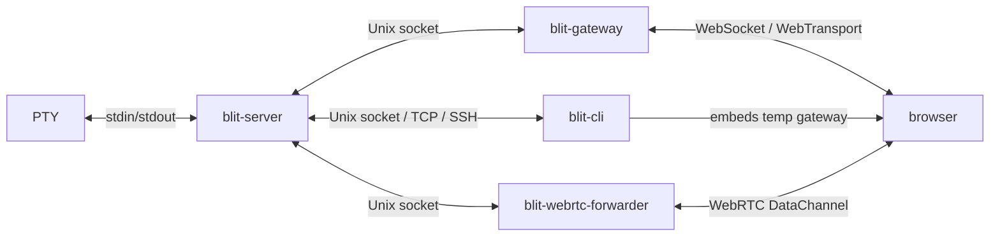
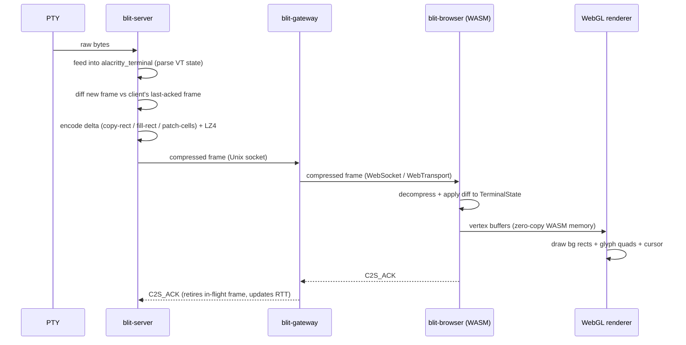

# Architecture

This document describes the internals of blit: how the pieces connect, how data moves through the system, and how the design stays transport-agnostic from the Unix socket up to the browser.

## System overview

blit is a terminal streaming stack. The server parses PTY output into structured terminal state, computes per-client binary diffs, and ships only the delta. The browser applies those diffs in WASM and renders with WebGL. Keystrokes travel the reverse path with no queuing.



The server is the stateful half. It owns PTYs, scrollback, parsed terminal state, and per-client frame pacing. The gateway is stateless: it authenticates browser clients and proxies binary messages. This split means PTYs survive gateway restarts, the gateway can sit behind a reverse proxy, and the CLI can embed a temporary gateway when it needs browser access without a persistent deployment.

## Crate map

| Crate                   | Directory                  | Kind          | Purpose                                                                                                              |
| ----------------------- | -------------------------- | ------------- | -------------------------------------------------------------------------------------------------------------------- |
| `blit-remote`           | `crates/remote/`           | lib           | Wire protocol: message builders/parsers, frame containers, state primitives, LZ4 compression                         |
| `blit-alacritty`        | `crates/alacritty-driver/` | lib           | Terminal parsing backend wrapping `alacritty_terminal`; snapshot generation, scrollback, title/mode tracking, search |
| `@blit-sh/browser`      | `crates/browser/`          | cdylib (WASM) | Applies compressed frame diffs, produces WebGL vertex data, manages glyph atlas                                      |
| `@blit-sh/core`         | `js/core/`                 | npm           | Framework-agnostic core: transports, workspace, connections, terminal surface, WebGL renderer                        |
| `@blit-sh/react`        | `js/react/`                | npm           | Thin React wrapper: context provider, hooks, and `BlitTerminal` component delegating to core                        |
| `@blit-sh/solid`        | `js/solid/`                | npm           | Thin Solid wrapper: context provider, primitives, and `BlitTerminal` component delegating to core                   |
| `blit-server`           | `crates/server/`           | bin           | PTY host and frame scheduler. Listens on Unix socket.                                                                |
| `blit-gateway`          | `crates/gateway/`          | bin           | WebSocket/WebTransport proxy with passphrase auth                                                                    |
| `blit` (CLI)            | `crates/cli/`              | bin           | Browser/console client, agent subcommands, SSH tunneling, embedded gateway, `server`/`share` subcommands             |
| `blit-webrtc-forwarder` | `crates/webrtc-forwarder/` | lib + bin     | WebRTC bridge: signaling, STUN/TURN NAT traversal, peer-to-peer data channels to blit-server                         |
| `blit-fonts`            | `crates/fonts/`            | lib           | Font discovery and metadata (TTF/OTF `name`/`post`/`hmtx` table parsing)                                             |
| `blit-webserver`        | `crates/webserver/`        | lib           | Shared axum HTTP helpers for serving assets and fonts                                                                |

Each Rust crate is a single `lib.rs` or `main.rs` with no multi-file module trees (`blit-cli` is split into `main.rs`, `transport.rs`, `interactive.rs`, and `agent.rs`; `blit-webrtc-forwarder` is split into `lib.rs`, `main.rs`, `peer.rs`, `signaling.rs`, `ice.rs`, and `turn.rs`).

### Dependency graph

```mermaid
graph TD
    remote[blit-remote] --> alacritty[blit-alacritty]
    remote --> browser[blit-browser]
    remote --> cli[blit-cli]

    alacritty --> server[blit-server]
    browser --> core[@blit-sh/core]
    core --> react[@blit-sh/react]
    core --> solid[@blit-sh/solid]
    react --> webapp[web-app]

    fonts[blit-fonts] --> webserver[blit-webserver]
    webserver --> gateway[blit-gateway]
    webserver --> cli

    remote --> forwarder[blit-webrtc-forwarder]
    server --> cli
    forwarder --> cli
```

## Wire protocol

All messages use a custom binary format defined in `blit-remote`. There is no protobuf, JSON, or external schema language. The protocol is symmetric in framing but asymmetric in message types: clients send `C2S_*` messages, servers send `S2C_*` messages.

### Framing

Every non-WebSocket transport wraps messages in a **4-byte little-endian length prefix** followed by the payload. WebSocket provides its own framing, so the length prefix is omitted there. This framing is identical across all components:

- Server: `read_frame` / `write_frame` in `crates/server/src/main.rs`
- CLI: `crates/cli/src/transport.rs`
- Gateway: `crates/gateway/src/main.rs`
- Browser WebTransport/WebRTC: `js/core/src/transports/`

Maximum frame size is 16 MiB.

### Message format

Every message starts with a **1-byte opcode**. Fields are packed in little-endian with no padding or alignment. PTY identifiers are 2-byte unsigned integers.

**Client-to-server (C2S):**

| Opcode | Name             | Layout                                                              |
| ------ | ---------------- | ------------------------------------------------------------------- |
| `0x00` | `INPUT`          | `[pty_id:2][data:N]`                                                |
| `0x01` | `RESIZE`         | `[pty_id:2][rows:2][cols:2]...` (batch, repeating)                  |
| `0x02` | `SCROLL`         | `[pty_id:2][offset:4]`                                              |
| `0x03` | `ACK`            | (empty)                                                             |
| `0x04` | `DISPLAY_RATE`   | `[fps:2]`                                                           |
| `0x05` | `CLIENT_METRICS` | `[backlog:2][ack_ahead:2][apply_ms_x10:2]`                          |
| `0x06` | `MOUSE`          | `[pty_id:2][type:1][button:1][col:2][row:2]`                        |
| `0x07` | `RESTART`        | `[pty_id:2]`                                                        |
| `0x10` | `CREATE`         | `[rows:2][cols:2][tag_len:2][tag:N]`                                |
| `0x11` | `FOCUS`          | `[pty_id:2]`                                                        |
| `0x12` | `CLOSE`          | `[pty_id:2]`                                                        |
| `0x13` | `SUBSCRIBE`      | `[pty_id:2]`                                                        |
| `0x14` | `UNSUBSCRIBE`    | `[pty_id:2]`                                                        |
| `0x15` | `SEARCH`         | `[request_id:2][query:N]`                                           |
| `0x16` | `CREATE_AT`      | `[rows:2][cols:2][src_pty_id:2][tag_len:2][tag:N]`                  |
| `0x17` | `CREATE_N`       | `[nonce:2][rows:2][cols:2][tag_len:2][tag:N]`                       |
| `0x18` | `CREATE2`        | `[nonce:2][rows:2][cols:2][features:1][tag_len:2][tag:N][optional]` |
| `0x19` | `READ`           | `[nonce:2][pty_id:2][offset:4][limit:4][flags:1]`                   |

`CREATE2` extends `CREATE` with a nonce for response correlation and optional fields gated by feature bits (`HAS_SRC_PTY`, `HAS_COMMAND`).

`READ` requests text from a PTY's scrollback + viewport. `offset` is the number of lines to skip (from the top by default, or from the end when `READ_TAIL` is set). `limit` is the max lines to return (0 = all). `flags`: bit 0 (`READ_ANSI`) includes ANSI color/style escape sequences in the response; bit 1 (`READ_TAIL`) counts `offset` from the end instead of the start. The server responds with `S2C_TEXT` echoing the same nonce.

**Server-to-client (S2C):**

| Opcode | Name             | Layout                                                 |
| ------ | ---------------- | ------------------------------------------------------ |
| `0x00` | `UPDATE`         | `[pty_id:2][lz4-compressed-frame]`                     |
| `0x01` | `CREATED`        | `[pty_id:2][tag:N]`                                    |
| `0x02` | `CLOSED`         | `[pty_id:2]`                                           |
| `0x03` | `LIST`           | `[count:2][entries...]`                                |
| `0x04` | `TITLE`          | `[pty_id:2][title:N]`                                  |
| `0x05` | `SEARCH_RESULTS` | `[request_id:2][results...]`                           |
| `0x06` | `CREATED_N`      | `[nonce:2][pty_id:2][tag:N]`                           |
| `0x07` | `HELLO`          | `[version:2][features:4]`                              |
| `0x08` | `EXITED`         | `[pty_id:2][exit_status:4]`                            |
| `0x09` | `READY`          | (empty)                                                |
| `0x0A` | `TEXT`           | `[nonce:2][pty_id:2][total_lines:4][offset:4][text:N]` |

### Feature negotiation

On connect, the server sends `S2C_HELLO` with a protocol version and a 4-byte feature bitmask. Current features:

| Bit | Name           | Meaning                                                        |
| --- | -------------- | -------------------------------------------------------------- |
| 0   | `CREATE_NONCE` | Server supports `CREATE2` / `CREATED_N` with nonce correlation |
| 1   | `RESTART`      | Server supports `C2S_RESTART` to respawn exited PTYs           |
| 2   | `RESIZE_BATCH` | Server accepts batched resize entries in a single `C2S_RESIZE` |

### Frame update encoding

The `S2C_UPDATE` payload (after the opcode and pty_id) is LZ4-compressed (`lz4_flex::compress_prepend_size`). Decompressed, it contains:

**Header (12 bytes):**

```
[rows:2][cols:2][cursor_row:2][cursor_col:2][mode:2][title_field:2]
```

The `title_field` packs flags into the upper bits and a title length into the lower 12 bits:

| Bit  | Flag                 |
| ---- | -------------------- |
| 15   | `TITLE_PRESENT`      |
| 14   | `OPS_PRESENT`        |
| 13   | `STRINGS_PRESENT`    |
| 12   | `LINE_FLAGS_PRESENT` |
| 0-11 | Title UTF-8 length   |

**Cell data** follows the header. Cells are encoded as differential operations:

- `OP_COPY_RECT (0x01)`: Copy a rectangle of cells from a source position. Encodes scrolling without resending visible content.
- `OP_FILL_RECT (0x02)`: Fill a rectangle with a single cell value. Efficient for clears and blank regions.
- `OP_PATCH_CELLS (0x03)`: Bitmask-indexed individual cell updates with column-major interleaving. Only changed cells are sent.

Each cell is exactly **12 bytes**:

```
Byte 0 (flags0): fg_type[2] | bg_type[2] | bold | dim | italic | underline
Byte 1 (flags1): inverse | wide | wide_continuation | content_len[3] | ...
Bytes 2-4:       fg color (r, g, b) or indexed
Bytes 5-7:       bg color (r, g, b) or indexed
Bytes 8-11:      UTF-8 content (up to 4 bytes)
```

Color types: 0 = default, 1 = indexed (256-color), 2 = RGB true color. When `content_len == 7`, the cell's text overflows 4 bytes; bytes 8-11 hold an FNV-1a hash for diff comparison, and the actual string is stored in an overflow table keyed by cell index, transmitted in the `STRINGS_PRESENT` section of the frame.

### Mode bits

A 16-bit mode field is transmitted with each frame, carrying terminal state that affects input handling:

- Bits 0-8: cursor style, app cursor, app keypad, alt screen, mouse mode (X10/VT200/button-event/any-event), mouse encoding (UTF-8/SGR/pixel)
- Bit 9: PTY echo flag (from `tcgetattr`)
- Bit 10: PTY canonical mode (from `tcgetattr`)

These are tracked by `ModeTracker` in `blit-alacritty`, which parses CSI/DCS sequences from raw PTY output to detect mode changes (DECCKM, DECSCUSR, mouse modes `?9h`, `?1000h`, `?1002h`, `?1003h`, SGR encoding `?1006h`, etc.).

## Transport agnosticism

The protocol is defined purely in terms of byte streams. Any transport that can carry ordered, reliable bytes can host a blit session. The system currently supports five:

### Unix domain socket (primary)

`blit-server` binds a `UnixListener`. Socket path resolution:

1. `$BLIT_SOCK` environment variable
2. `$TMPDIR/blit.sock`
3. `$XDG_RUNTIME_DIR/blit.sock`
4. `/tmp/blit-$USER.sock`
5. `/tmp/blit.sock`

Clients (gateway, CLI) connect to this socket and exchange length-prefixed binary frames. This is the only server-side transport; all other transports ultimately proxy to it.

### systemd socket activation

When `LISTEN_FDS=1` is set, the server adopts file descriptor 3 as the listening socket instead of binding its own. Systemd units are provided:

- `blit-server.socket` / `blit-server.service` -- user-level, socket at `%t/blit.sock` (runs `blit-server`)
- `blit.socket` / `blit.service` -- user-level, socket at `%t/blit.sock` (runs `blit server`)
- `blit-server@.socket` / `blit-server@.service` -- system-wide, per-user, socket at `/run/blit/%i.sock`
- `blit-webrtc-forwarder@.service` -- system-wide, per-instance WebRTC forwarder reading config from `/etc/blit/forwarder-%i.env`

### fd-channel

An external process can pass pre-connected client file descriptors to the server via `SCM_RIGHTS` ancillary messages over a Unix socket pair. Configured with `--fd-channel FD` or `BLIT_FD_CHANNEL`.

The server calls `recvmsg()` with `CMSG_SPACE` to receive file descriptors from the channel. Each received fd is treated as an already-connected client stream -- the server wraps it in a tokio `UnixStream` and spawns a client handler.

This is the integration point for embedding `blit-server` inside another process or service manager that wants to control connection acceptance, enforce its own auth, or sandbox the server.

### WebSocket

`blit-gateway` (and the CLI's embedded gateway) accepts WebSocket connections from browsers. Auth is a text-message handshake: the client sends the passphrase, the server responds `"ok"` or `"auth"` (rejected). After auth, all messages are binary WebSocket frames with no length prefix (WebSocket provides its own framing).

The gateway opens a new Unix socket connection to `blit-server` for each authenticated browser client and proxies bidirectionally.

### WebTransport (QUIC/HTTP3)

Enabled with `BLIT_QUIC=1`. The gateway listens for QUIC connections on the same port as HTTP. A single bidirectional QUIC stream carries the session, using the same 4-byte length-prefixed framing as Unix sockets. Auth is a 2-byte-LE-length passphrase followed by a 1-byte response.

Self-signed certificates are auto-generated and rotated every 13 days. The certificate's SHA-256 hash is injected into the served HTML page as `window.__blitCertHash`, allowing the browser to pin it via `serverCertificateHashes` in the `WebTransport` constructor.

### WebRTC DataChannel

`blit-webrtc-forwarder` bridges a blit-server session to browsers over WebRTC using `str0m` (a sans-I/O WebRTC library). An ordered DataChannel labeled `"blit"` carries length-prefixed frames identical to the Unix socket protocol. The forwarder connects to blit-server via its Unix socket when a peer's data channel opens.

**Signaling**: A single bidirectional WebSocket to `hub.blit.sh` carries JSON signaling messages (SDP offers/answers, ICE candidates). Messages are signed with Ed25519 (key derived from a passphrase via PBKDF2-SHA256, 100k rounds). The signaling server routes by public key.

**NAT traversal**: The forwarder gathers host candidates, performs STUN binding for server-reflexive candidates, and attempts TURN allocation (UDP first, then TCP/TLS) for relay candidates. TURN allocations are refreshed every 4 minutes; TURN permissions are re-established on the same interval.

**Lifecycle**: WebRTC peer connections are decoupled from the signaling WebSocket. An `established` flag (per peer) prevents tearing down active data channel sessions on WebSocket reconnect — only peers still in the signaling phase are aborted.

The `blit share` CLI subcommand is the primary entry point. It auto-starts a blit-server if one isn't already running, then runs the forwarder in-process. The standalone `blit-webrtc-forwarder` binary is available for custom deployments.

On the browser side, `@blit-sh/core` includes a `WebRtcDataChannelTransport` that connects to the forwarder via the same signaling server.

### SSH tunneling (CLI)

`blit-cli` can connect to a remote `blit-server` over SSH in two ways:

- **Console mode**: pipes through `ssh -T host 'nc -U $SOCK'` (or `socat`), using the SSH process's stdin/stdout as the byte stream. The remote socket path is resolved on the remote host using the same cascade (`$BLIT_SOCK` → `$TMPDIR/blit.sock` → `/tmp/blit-$USER.sock` → `/run/blit/$USER.sock` → `$XDG_RUNTIME_DIR/blit.sock` → `/tmp/blit.sock`), where `$USER` is the SSH user.
- **Browser mode**: uses `ssh -L local.sock:remote.sock` to forward a local Unix socket to the remote server, then starts a local embedded gateway pointing at the forwarded socket.

### Transport abstraction

On the Rust side, `blit-cli` defines a `Transport` enum (in `crates/cli/src/transport.rs`) over `UnixStream`, `TcpStream`, and SSH `Child` process. All variants are split into `Box<dyn AsyncRead> + Box<dyn AsyncWrite>` via a `split()` method -- the rest of the client is transport-agnostic.

### Agent subcommands

`blit-cli` includes non-interactive subcommands (`list`, `start`, `show`, `history`, `send`, `close`, `wait`, `restart`) in `crates/cli/src/agent.rs` for programmatic control of PTYs. It also includes `server` (run blit-server in-process) and `share` (run blit-webrtc-forwarder in-process, auto-starting a server if needed). These connect, perform a single operation over the binary protocol, and exit. They are designed for LLM agents and scripts: output is plain text (TSV for `list`, raw terminal text for `show`/`history`), errors go to stderr, and exit codes indicate success or failure. All subcommands accept the same transport options (`--socket`, `--tcp`, `--ssh`) as the interactive modes.

On the TypeScript side, the `BlitTransport` interface abstracts over WebSocket, WebTransport, and WebRTC:

```typescript
interface BlitTransport {
  connect(): void;
  send(data: Uint8Array): void;
  close(): void;
  readonly status: ConnectionStatus;
  addEventListener(
    type: "message",
    listener: (data: ArrayBuffer) => void,
  ): void;
  addEventListener(
    type: "statuschange",
    listener: (status: ConnectionStatus) => void,
  ): void;
  removeEventListener(type: string, listener: Function): void;
}
```

Any implementation of this interface can be passed to `BlitWorkspace` as a connection transport.

## Server control

`blit-server` is a single async Rust binary (tokio runtime) that manages PTYs and clients. It has no CLI subcommands and no RPC API beyond the binary protocol described above. Configuration is entirely via environment variables:

| Variable          | Default                                             | Purpose                     |
| ----------------- | --------------------------------------------------- | --------------------------- |
| `SHELL`           | `/bin/sh`                                           | Shell to spawn for new PTYs |
| `BLIT_SOCK`       | `$TMPDIR/blit.sock` or `$XDG_RUNTIME_DIR/blit.sock` | Unix socket path            |
| `BLIT_SCROLLBACK` | `10000`                                             | Scrollback rows per PTY     |
| `BLIT_FD_CHANNEL` | unset                                               | fd-channel file descriptor  |

### How clients control the server

All server control happens through the binary protocol. There is no separate control channel or admin API. When a client connects, it receives an initial burst: `S2C_HELLO` (version + features), `S2C_LIST` (existing PTYs), per-PTY `S2C_TITLE` and `S2C_EXITED` messages, and finally `S2C_READY` to signal the initial state is complete. From there, the client sends protocol messages to create, close, focus, subscribe, resize, search, read, and restart PTYs.

The server mediates multi-client state:

- **PTY sizing**: each client reports its desired size per PTY via `C2S_RESIZE`. The server computes the effective size as the minimum across all clients that have that PTY subscribed, so the terminal fits every viewer.
- **Focus**: each client has an independent focus (`C2S_FOCUS`). The focused PTY gets full frame rate; subscribed-but-unfocused PTYs get a lower preview rate.
- **Subscriptions**: clients subscribe/unsubscribe to individual PTYs. The server only sends frame updates for subscribed PTYs.

### Lifecycle

PTYs are created via `C2S_CREATE` or `C2S_CREATE2`. The server forks, sets up a PTY pair via `openpty`, execs the shell (or a custom command), and registers the master fd for async I/O. PTY output is fed through `alacritty_terminal` for VT parsing.

When a PTY's subprocess exits, the server captures the exit status from `waitpid()` and sends `S2C_EXITED` with the exit code. The `exit_status` field is `WEXITSTATUS` for normal exits (0, 1, ...), a negative signal number for signal deaths (-9 for SIGKILL, -15 for SIGTERM), or `EXIT_STATUS_UNKNOWN` (`i32::MIN`) when the status couldn't be collected. The terminal state is retained — clients can still scroll and read. `C2S_RESTART` respawns the shell in the same slot. `C2S_CLOSE` dismisses the PTY entirely.

## Per-client frame pacing

The server maintains detailed per-client congestion state:

- **RTT estimation**: EWMA and minimum-path RTT, measured via the `C2S_ACK` protocol. Each frame sent increments an in-flight counter; each ACK retires the oldest in-flight frame and updates RTT.
- **Bandwidth estimation**: EWMA of delivered payload rate (bytes/sec from per-frame delivery time) and ACK-window goodput (bytes/sec from ACK cadence). Jitter tracking (EWMA + decaying peak) feeds into a conservative bandwidth floor.
- **Frame window**: frames in flight are capped at the bandwidth-delay product, measured in both frame count and byte budget. The window adapts to RTT and display rate: high-latency links get deeper pipelines to stay fully utilized.
- **Display pacing**: the client reports its display refresh rate (`C2S_DISPLAY_RATE`), backlog depth, ack-ahead count, and frame apply time (`C2S_CLIENT_METRICS`). The server spaces frame sends to match the client's actual render rate, backing off when backlog grows.
- **Preview budgeting**: background (unfocused but subscribed) PTYs share leftover bandwidth after the focused PTY's needs are met. Preview frame rate is capped to avoid starving the lead session.
- **Probe/backoff**: after a conservative backoff, the server gradually probes with additive window growth. Probe frames decay when queue delay rises.

This means a fast client on localhost gets frames as fast as it can render them, while a slow client on a mobile connection gets paced to its actual capacity, and neither blocks the other.

## Frontend rendering

### WASM runtime (`blit-browser`)

`blit-browser` compiles to `wasm32-unknown-unknown` and is loaded by the React library. It maintains a `TerminalState` (the grid of 12-byte cells) and applies incoming compressed frame diffs via `feed_compressed()`.

When the React component requests a render, the WASM module:

1. Iterates all cells in the grid.
2. Resolves foreground/background colors through the current palette (indexed colors, default colors, dim/bold modifiers).
3. Coalesces adjacent cells with the same background color into merged rectangle operations.
4. For each cell with visible content, creates a `GlyphKey` (UTF-8 bytes + bold/italic/underline/wide flags), ensures it exists in the glyph atlas, and emits 6 vertices (2 triangles) referencing the atlas texture coordinates.
5. Exposes the vertex buffers to JavaScript via zero-copy WASM linear memory pointers (`bg_verts_ptr/len`, `glyph_verts_ptr/len`).

### Glyph atlas

The atlas is a **Canvas 2D `HTMLCanvasElement`**, not a GPU texture. It uses row-based bin packing to allocate glyph slots.

When a new glyph is needed:

1. A slot is allocated in the atlas canvas (power-of-two size, 2048 to 8192 px).
2. The canvas 2D context sets font style (`"bold italic Npx family"`) and calls `fillText()` with the codepoint rendered in white.
3. Underlines are drawn with `ctx.stroke()` when the cell has the underline attribute.
4. The slot coordinates are cached in an `FxHashMap<GlyphKey, GlyphSlot>`.

The atlas canvas is uploaded to a WebGL texture once per frame (skipped if unchanged). The GL shader tints white glyphs with the per-vertex foreground color; color glyphs (emoji) pass through untinted.

### WebGL renderer

Two shader programs handle all drawing:

- **RECT shader**: draws colored rectangles for cell backgrounds and the cursor. Vertex attributes: position (vec2) and color (vec4). Uses premultiplied alpha blending.
- **GLYPH shader**: draws textured quads from the glyph atlas. Vertex attributes: position, UV coordinates, and color. The fragment shader detects grayscale vs. color glyphs: grayscale are tinted with the vertex color, color glyphs (emoji) are rendered directly.

Both programs batch vertices up to 65,532 per draw call.

### Render loop (`BlitTerminal`)

The render loop is demand-driven via `requestAnimationFrame`:

1. WASM `prepare_render_ops()` builds vertex buffers.
2. `Float32Array` views are created over WASM linear memory (zero-copy).
3. The WebGL renderer draws background rectangles, glyph quads, and the cursor to a shared offscreen canvas.
4. The shared canvas is composited to the display canvas via `ctx.drawImage()`.
5. Canvas 2D overlays are drawn on top: text selection highlights, URL hover underlines, overflow text (emoji/multi-codepoint), predicted echo (keystroke echo before server confirmation), and a scrollbar.

### Input handling

Keyboard input is captured via a hidden `<textarea>` element. `keyToBytes()` in `keyboard.ts` converts `KeyboardEvent` objects to terminal escape sequences:

- Ctrl+letter to control codes, arrow keys to `\x1b[A` / `\x1bOA` (respecting app cursor mode), function keys to `\x1b[15~`-style sequences, modifier combos to `\x1b[1;{mod}X` format.
- IME/composition input is handled via the `compositionend` event.
- Alt+key sends an `\x1b` prefix.

Mouse events are sent as `C2S_MOUSE` messages. The server generates the correct escape sequence based on the PTY's current mouse mode and encoding (X10, VT200, SGR, pixel). Client-side text selection (word/line granularity, drag) and clipboard copy are handled independently of terminal mouse mode.

## How a frame moves through the system



## Terminal emulation

Terminal parsing is handled by `alacritty_terminal` (v0.25), wrapped by `blit-alacritty`. The wrapper adds:

- **Snapshot generation**: converts `alacritty_terminal`'s `Term` state into `blit-remote::FrameState` (the 12-byte cell grid format).
- **Scrollback frames**: generates frames at arbitrary scroll offsets into the scrollback buffer.
- **Mode tracking**: a custom `ModeTracker` parses CSI/DCS sequences from raw PTY output to track app cursor mode, app keypad mode, alt screen, mouse modes, mouse encoding, cursor style, and synchronized output. These are packed into the 16-bit mode field sent with each frame.
- **Search**: full-text search across visible content, titles, and scrollback, returning scored results with match context and scroll offsets.

The server periodically queries `tcgetattr` on the PTY master fd to detect echo and canonical mode flags, which are packed into the mode field so the client can implement predicted echo (showing keystrokes before the server confirms them).

## Font system

`blit-fonts` discovers system fonts by scanning standard directories (`~/Library/Fonts`, `/usr/share/fonts`, etc.) and falling back to `fc-match`/`fc-list` when available. It parses TTF/OTF `name` tables for family/style metadata, `post` tables for monospace detection, and `hmtx` tables for uniform advance width verification.

The gateway and CLI serve discovered fonts to the browser as `@font-face` CSS with base64-encoded font data, so the browser renders with the same fonts available on the server's system.
