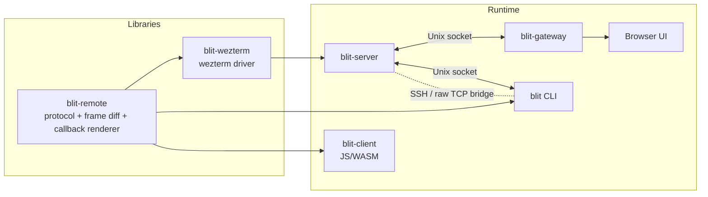

# blit

Low-latency terminal streaming for long-fat networks.

`blit-server` multiplexes PTYs on a Unix socket, diffs terminal state into compact binary frames, and ships those frames to browser, terminal, or JS/WASM clients. The current codebase splits more of that stack into reusable crates, uses the wezterm parser end to end, introduces a browser Expose switcher with live previews, and adds a callback-rendered demo that does not depend on escape-sequence parsing.

blit is tuned for links where stop-and-wait falls apart: 12-byte cells, LZ4-compressed frame payloads, independent title updates, client-reported display metrics, and sender pacing sized for high RTT paths instead of LAN-only defaults.

## Quick Start

### Local dev shell

```bash
nix develop
```

Inside the dev shell:

```bash
# Terminal 1
cargo run -p blit-server

# Terminal 2
BLIT_PASS=secret cargo run -p blit-gateway

# Terminal 3
cargo run -p blit-cli
```

Then:

- Open `http://localhost:3264` in a browser and enter `secret`, or
- Use the terminal client with `blit`.

If you use `direnv`, `.envrc` already wires the flake and adds the local `bin/` scripts to `PATH`.

### Auto-reload loop

```bash
nix develop
dev
```

`dev` runs `process-compose.yml`, which starts:

- browser JS/WASM asset rebuilds under `cargo watch`
- `blit-server` under `cargo watch`
- `blit-gateway` under `cargo watch`, including `web/` asset changes

## Workspace

### Binaries

- `blit-server`: PTY host and frame producer
- `blit-gateway`: HTTP/WebSocket gateway for browsers
- `blit` / `blit-cli`: terminal client
- `blit-demo`: local demos, including `netdash`

### Libraries

- `blit-remote`: protocol, frame diffs, terminal state decode, and callback/DOM rendering
- `blit-wezterm`: wezterm-backed terminal driver
- `blit-browser`: browser renderer/WASM module embedded by the gateway
- `blit-client`: JS/WASM terminal client package built from `npm/`
- `blit-react`: React component wrapping blit-client with injectable transport (`react/`)

## Architecture



## Runtime Guide

### `blit-server`

The server manages PTYs, tracks terminal state, and publishes updates over a Unix socket.

The server uses the `wezterm` parser backend.

```bash
blit-server
blit-server --socket /tmp/blit.sock
```

| Variable | Default | Description |
|---|---|---|
| `SHELL` | `/bin/sh` | Shell to spawn for new PTYs |
| `BLIT_SOCK` | `$XDG_RUNTIME_DIR/blit.sock` or `/tmp/blit.sock` | Unix socket path (ignored under socket activation) |
| `BLIT_SCROLLBACK` | `10000` | Scrollback rows per PTY |

#### systemd socket activation

The server supports `LISTEN_FDS=1` for systemd-style socket activation. Each user gets a socket at `/run/blit/<user>.sock` that starts the server on first connection.

**NixOS** — add the flake input and enable the module:

```nix
# flake.nix
{
  inputs.blit.url = "github:indent-com/blit";
}

# configuration.nix
{ inputs, ... }: {
  imports = [ inputs.blit.nixosModules.blit ];

  services.blit = {
    enable = true;
    users = [ "alice" "bob" ];
    # shell = "/run/current-system/sw/bin/fish";  # optional
    # scrollback = 20000;                         # optional, default 10000
    gateways.alice = {
      user = "alice";
      port = 3264;
      passFile = "/run/secrets/blit-alice-pass"; # file containing BLIT_PASS=...
    };
  };
}
```

**Other distros** — install the systemd template units:

```bash
sudo cp systemd/blit@.socket systemd/blit@.service /etc/systemd/system/
sudo systemctl daemon-reload
sudo systemctl enable --now blit@alice.socket
```

Either way, from any machine:

```bash
blit alice@myhost    # opens browser, SSH forwards to /run/blit/alice.sock
```

The `blit-server-deb` package ships these unit files in `/lib/systemd/system/`.

### `blit-gateway`

The gateway serves the browser UI and proxies WebSocket traffic to the server's Unix socket.

```bash
BLIT_PASS=secret blit-gateway
BLIT_PASS=secret BLIT_ADDR=127.0.0.1:3264 blit-gateway
```

| Variable | Default | Description |
|---|---|---|
| `BLIT_PASS` | required | Browser passphrase |
| `BLIT_ADDR` | `0.0.0.0:3264` | HTTP/WebSocket listen address |
| `BLIT_SOCK` | `/run/blit/$USER.sock`, then `$XDG_RUNTIME_DIR/blit.sock`, then `/tmp/blit.sock` | Upstream server socket |

### `blit`

The CLI connects to a blit-server and opens the browser UI. A bare hostname is treated as an SSH target.

```bash
blit                        # local server, browser UI
blit myhost                 # SSH to myhost, browser UI
blit user@host              # SSH with explicit user
blit --console              # local server, terminal renderer
blit --console myhost       # SSH to myhost, terminal renderer
blit --socket /path.sock    # explicit Unix socket
blit --tcp host:9000        # raw TCP
```

By default, `blit` opens a browser tab backed by an embedded HTTP+WebSocket server on loopback. Each browser tab gets its own blit-server session. SSH connections are multiplexed over a single TCP connection using `-L` Unix socket forwarding (no `nc` or `socat` needed on the remote).

Use `--console` for the ANSI terminal renderer instead of the browser.

| Variable | Default | Description |
|---|---|---|
| `BLIT_SOCK` | `/run/blit/$USER.sock`, then `$XDG_RUNTIME_DIR/blit.sock`, then `/tmp/blit.sock` | Unix socket path |
| `BLIT_DISPLAY_FPS` | `240` | Advertised client display rate (console mode), clamped to `10..=1000` |

### Browser UI

Open the gateway address, enter the passphrase, and the browser keeps one lead terminal at full size.

Press `Ctrl/Cmd+K` to open Expose. It shows live PTY previews, searches titles as you type, lets you switch with `Enter`, arrow keys, or a click, and includes a `+` button to open a new PTY. `Ctrl+Shift+B` toggles backlog for the focused PTY.

Shortcuts:

| Shortcut | Action |
|---|---|
| `Ctrl`/`Cmd`+`K` | Open Expose / switch PTY |
| `Ctrl+Shift+W` | Close focused PTY |
| `Ctrl+Shift+B` | Toggle backlog |
| `Shift+PageUp` / `Shift+PageDown` | Scrollback |
| `Ctrl+Shift+/` | Toggle help |

Mouse behavior:

- Selection copies both `text/plain` and `text/html`
- Wheel scrolls scrollback unless the PTY has mouse mode enabled, in which case the event is forwarded

## JS/WASM Client

The `blit-client` package exposes the shared protocol helpers and terminal state machine without tying you to the browser UI.

```ts
import {
  Terminal,
  parse_server_msg,
  msg_ack,
  msg_create,
  msg_input,
  msg_resize,
  msg_subscribe,
  msg_unsubscribe,
  S2C_CREATED,
  S2C_TITLE,
  S2C_UPDATE,
} from "blit-client";

const term = new Terminal(24, 80);

const create = msg_create(24, 80);
const resize = msg_resize(0, 30, 120);
const input = msg_input(0, new Uint8Array([0x6c, 0x73, 0x0d]));
const subscribe = msg_subscribe(0);
const unsubscribe = msg_unsubscribe(0);
const ack = msg_ack();

const msg = parse_server_msg(frame);
if (!msg) return;

switch (msg.kind()) {
  case S2C_UPDATE():
    term.feed_compressed(msg.payload());
    console.log(term.title(), term.get_all_text());
    break;
  case S2C_TITLE():
    console.log(`title for ${msg.pty_id()}: ${msg.title()}`);
    break;
  case S2C_CREATED():
    console.log(`created ${msg.pty_id()}`);
    break;
}
```

Useful API surface:

- `feed_compressed(data)` and `feed_compressed_batch(batch)`
- `title()`, `get_text(...)`, `get_all_text()`, `get_cell(...)`
- `cursor_visible()`, `app_cursor()`, `bracketed_paste()`, `mouse_mode()`, `mouse_encoding()`, `echo()`, `icanon()`
- `msg_create`, `msg_input`, `msg_resize`, `msg_focus`, `msg_close`, `msg_subscribe`, `msg_unsubscribe`, `msg_ack`, `msg_scroll`, `msg_search`, `msg_display_rate`, `msg_client_metrics`
- `parse_server_msg(...)` preserves rich search metadata via `search_result_count()`, `search_result(i)`, and `search_results()`

## React Component

The `blit-react` package (`react/`) embeds a blit terminal in any React app. Networking is an injected dependency — bring your own transport.

### Quick start

```tsx
import { BlitTerminal, WebSocketTransport, useBlitSessions } from "blit-react";
import { useRef } from 'react';

function App() {
  const transport = useRef(
    new WebSocketTransport('wss://myhost:3264/', 'secret'),
  ).current;
  const { sessions, createPty } = useBlitSessions(transport, {
    autoCreateIfEmpty: true,
  });
  const active = sessions.find((s) => s.state === 'active');

  return (
    <BlitTerminal
      transport={transport}
      ptyId={active?.ptyId ?? null}
      style={{ width: '100%', height: '100vh' }}
    />
  );
}
```

### `useBlitSessions`

Manages the session lifecycle: LIST, CREATED, CLOSED, and TITLE parsing. Returns reactive state and control functions.

```ts
const { ready, sessions, status, createPty, focusPty, closePty } =
  useBlitSessions(transport, {
    autoCreateIfEmpty: true,          // create a PTY if the server has none
    getInitialSize: () => ({ rows: 24, cols: 80 }),
  });
```

| Field | Type | Description |
|---|---|---|
| `ready` | `boolean` | `true` after the first LIST is received. |
| `sessions` | `readonly BlitSession[]` | Current sessions with `ptyId`, `tag`, `title`, and `state`. |
| `status` | `ConnectionStatus` | Transport connection status. |
| `createPty` | `(opts?) => void` | Create a PTY. Accepts `{ rows?, cols?, command?, tag? }`. |
| `focusPty` | `(ptyId) => void` | Focus a PTY on the server. |
| `closePty` | `(ptyId) => void` | Close a PTY. |

### `<BlitTerminal>`

Renders a single PTY. Owns FOCUS, RESIZE, INPUT, SCROLL, mouse/keyboard encoding, and ACK after updates.

| Prop | Type | Description |
|---|---|---|
| `transport` | `BlitTransport` | **Required.** Transport instance for server communication. |
| `ptyId` | `number \| null` | PTY to display. `null` = waiting for a PTY. |
| `fontFamily` | `string` | CSS font family. Default: `"PragmataPro, ui-monospace, monospace"` |
| `fontSize` | `number` | Font size in CSS pixels. Default: `13` |
| `className` | `string` | CSS class for the container div. |
| `style` | `CSSProperties` | Inline styles for the container div. |

### Imperative handle

```tsx
const termRef = useRef<BlitTerminalHandle>(null);

<BlitTerminal ref={termRef} transport={transport} ptyId={ptyId} />

termRef.current?.focus();               // focus the input sink
termRef.current?.terminal;              // underlying WASM Terminal instance
termRef.current?.rows;                  // current grid dimensions
termRef.current?.cols;
termRef.current?.status;                // 'connecting' | 'connected' | ...
```

### Transport interface

Implement `BlitTransport` for any binary channel:

```ts
interface BlitTransport {
  send(data: Uint8Array): void;
  close(): void;
  readonly status: ConnectionStatus;
  onmessage: ((data: ArrayBuffer) => void) | null;
  onstatuschange: ((status: ConnectionStatus) => void) | null;
}
```

Two transports are included:

**`WebSocketTransport`** — authenticating WebSocket with auto-reconnect:

```ts
import { WebSocketTransport } from "blit-react";

const transport = new WebSocketTransport('wss://myhost:3264/', 'secret', {
  reconnect: true,
  reconnectDelay: 500,
  maxReconnectDelay: 10000,
  reconnectBackoff: 1.5,
});
```

**`createWebRtcDataChannelTransport`** — WebRTC data channel with 4-byte frame envelope:

```ts
import { createWebRtcDataChannelTransport } from "blit-react";

const transport = createWebRtcDataChannelTransport(peerConnection, {
  label: 'blit',
  displayRateFps: 120,
  connectTimeoutMs: 10000,
});

await transport.waitForSync();
```

### Hooks

For custom UIs that don't use the built-in `<BlitTerminal>`:

- **`useBlitSessions(transport, options?)`** — manages session lifecycle (LIST, CREATED, CLOSED, TITLE). Returns `{ ready, sessions, status, createPty, focusPty, closePty }`.
- **`useBlitConnection(transport, callbacks)`** — low-level server message parsing. Returns `sendInput`, `sendResize`, `sendCreate`, `sendFocus`, `sendClose`, `sendSubscribe`, `sendUnsubscribe`, `sendScroll`, `sendAck`, and `status`.
- **`useBlitTerminal(options?)`** — manages WASM `Terminal` lifecycle and cell metrics.
- **`measureCell(fontFamily, fontSize)`** — measures cell dimensions snapped to device pixels.

## Callback Rendering

`blit-remote` can render a last-known screen from a callback-driven DOM model, then diff and transmit that frame over the same transport used by the terminal path.

```rust
use blit_remote::{CallbackRenderer, CellStyle, Rect};

let mut renderer = CallbackRenderer::new(24, 80);
renderer.render(|dom| {
    dom.set_title("dashboard");
    dom.wrapped_text(
        Rect::new(0, 0, 3, 80),
        "Status text without a terminal parser",
        CellStyle::default(),
    );
    dom.scrolling_text(
        Rect::new(4, 0, 20, 80),
        ["line 1", "line 2", "line 3"],
        0,
        CellStyle::default(),
    );
});
```

That callback surface is what the new `netdash` demo uses.

## Demo: `netdash`

`netdash` is a Linux-only TCP dashboard rendered through `blit-remote` and painted directly into your local terminal.

```bash
cargo run -p blit-demo --bin netdash -- --fps 12 --poll-ms 120
```

What it does:

- reconciles Linux TCP state via `sock_diag` dumps on the configured interval
- applies `sock_diag` destroy notifications as they arrive
- keeps a rolling peer/connection model
- redraws at a capped presentation rate instead of on every sample
- supports keyboard and basic mouse interaction

Controls:

- `Tab` or `1/2/3`: switch panels
- arrows or `j/k`: move selection
- `Enter`: filter connections by the selected peer
- `s`: cycle sort order
- `c`: clear the current filter
- `?`: toggle help

## Building And Packaging

### Browser assets

```bash
./bin/build-browser
```

### Nix packages

```bash
nix build .#blit-server
nix build .#blit-cli
nix build .#blit-gateway
nix build .#blit-client
nix build .#blit-server-deb
nix build .#blit-cli-deb
nix build .#blit-gateway-deb
```

### npm publish

```bash
nix run .#npm-publish -- --dry-run        # blit-client
nix run .#npm-publish
nix run .#browser-publish -- --dry-run    # blit-browser
nix run .#browser-publish
nix run .#react-publish -- --dry-run      # blit-react
nix run .#react-publish
```

## Verification

The current branch passes:

- `nix develop -c cargo check --workspace`
- `nix develop -c cargo test -p blit-remote`

## License

MIT
