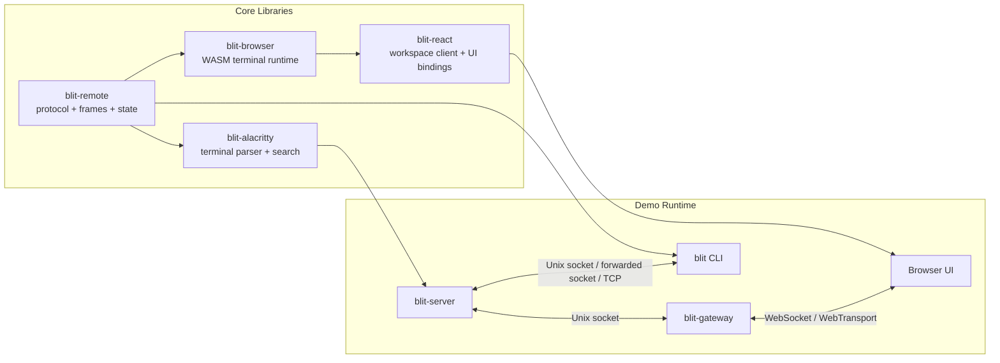

# blit

blit is a terminal streaming stack. The core libraries — `blit-server`, `blit-remote`, `blit-browser`, and `blit-react` — are the product. The CLI, gateway, and web app are a demo of what you can build with them.

## The stack

**`blit-server`** hosts PTYs and produces per-client frame diffs over a Unix socket. It tracks the full parsed terminal state for every PTY, compares against what each client has seen, and sends only the delta, LZ4-compressed. It paces output per client based on render metrics the client reports back.

**`blit-remote`** is the shared wire protocol: binary message builders, frame containers, state primitives.

**`blit-browser`** is the WASM terminal runtime. It receives compressed frame diffs and produces WebGL vertex data for rendering.

**`blit-react`** is the React embedding library. It manages workspaces, connections, sessions, transports, and rendering. This is the primary integration point for applications.

## The demo

Browser access to `blit-server` goes through either of two paths — you pick one, not both:

- **`blit-gateway`**: a standalone WebSocket/WebTransport proxy, deployed alongside the server for persistent browser access. Handles passphrase auth, serves the web app, optionally enables QUIC.
- **`blit` (the CLI)**: connects to a local or remote `blit-server` (over SSH if needed), embeds a temporary gateway, and opens the browser — no separate gateway deployment required. Also has a `--console` mode that renders directly in the terminal.

**`web-app/`** is the browser UI served by either path. It demonstrates multi-session management, BSP layouts, search, font/palette selection, and reconnection handling. It is a reference implementation, not a product surface.

## Why blit

Most browser terminals stream raw PTY bytes over a WebSocket and let the client parse them. blit does not.

- The server maintains parsed terminal state and sends binary frame diffs, not byte streams.
- Updates are LZ4-compressed. Scrolling is encoded as copy-rect operations.
- The client reports display rate, frame apply time, and backlog depth. The server paces each client independently.
- Keystrokes go straight to the PTY. Latency is bounded by link RTT and nothing else.
- The ACK protocol measures true round-trip time per client. Frames are pipelined to the bandwidth-delay product.
- The focused session gets full frame rate. Background sessions update at a lower rate.

## How it compares

| | blit | ttyd | gotty | Eternal Terminal | Mosh | xterm.js + node-pty |
| --- | --- | --- | --- | --- | --- | --- |
| Architecture | Separate PTY host + gateway | Single binary | Single binary | Client + daemon | Client + server | Library (BYO server) |
| Multiple PTYs | Yes, first-class | One per instance | One per instance | One per connection | One per connection | Manual |
| Protocol | Binary frame diffs | Terminal byte stream | Terminal byte stream | SSH + prediction | UDP + SSP | Terminal byte stream |
| Backpressure | Per-client pacing from render metrics | None | None | SSH flow control | None | None |
| Server-side search | Titles + visible + scrollback | No | No | No | No | No |
| Transport | WebSocket, WebTransport, Unix socket | WebSocket | WebSocket | TCP | UDP | WebSocket |
| Embeddable | React library | No | No | No | No | Yes (xterm.js) |

## Embedding with `blit-react`

`blit-react` is workspace-first. A `BlitWorkspace` owns connections, each connection owns sessions, and each `BlitTerminal` renders a session by ID.

```tsx
import {
  BlitTerminal,
  BlitWorkspace,
  BlitWorkspaceProvider,
  WebSocketTransport,
  useBlitFocusedSession,
  useBlitSessions,
  useBlitWorkspace,
} from "blit-react";
import { useEffect, useMemo } from "react";

function EmbeddedBlit({ wasm, passphrase }: { wasm: any; passphrase: string }) {
  const transport = useMemo(
    () => new WebSocketTransport("wss://example.com/blit", passphrase),
    [passphrase],
  );

  const workspace = useMemo(
    () =>
      new BlitWorkspace({
        wasm,
        connections: [{ id: "default", transport }],
      }),
    [transport, wasm],
  );

  useEffect(() => () => workspace.dispose(), [workspace]);

  return (
    <BlitWorkspaceProvider workspace={workspace}>
      <TerminalScreen />
    </BlitWorkspaceProvider>
  );
}

function TerminalScreen() {
  const workspace = useBlitWorkspace();
  const sessions = useBlitSessions();
  const focusedSession = useBlitFocusedSession();

  useEffect(() => {
    if (sessions.length > 0) return;
    void workspace.createSession({
      connectionId: "default",
      rows: 24,
      cols: 80,
    });
  }, [sessions.length, workspace]);

  return (
    <BlitTerminal
      sessionId={focusedSession?.id ?? null}
      style={{ width: "100%", height: "100vh" }}
    />
  );
}
```

### React API

| API | Purpose |
| --- | --- |
| `new BlitWorkspace({ wasm, connections })` | Create a workspace with one or more transports |
| `BlitWorkspaceProvider` | Put the workspace, palette, and font settings in context |
| `useBlitWorkspace()` | Get the imperative workspace object |
| `useBlitWorkspaceState()` | Read the full reactive workspace snapshot |
| `useBlitConnection(connectionId?)` | Read one connection snapshot |
| `useBlitSessions()` | Read all sessions |
| `useBlitFocusedSession()` | Read the currently focused session |
| `BlitTerminal` | Render one session by `sessionId` |

### Workspace operations

- `createSession({ connectionId, rows, cols, tag?, command?, cwdFromSessionId? })`
- `closeSession(sessionId)`
- `restartSession(sessionId)`
- `focusSession(sessionId | null)`
- `search(query, { connectionId? })`
- `setVisibleSessions(sessionIds)`
- `addConnection(...)` / `removeConnection(connectionId)` / `reconnectConnection(connectionId)`

### Transports

```ts
// WebSocket
new WebSocketTransport(url, passphrase, { reconnect, reconnectDelay, maxReconnectDelay, reconnectBackoff })

// WebTransport (QUIC/HTTP3)
new WebTransportTransport(url, passphrase, { reconnect, serverCertificateHash })

// WebRTC data channel
createWebRtcDataChannelTransport(peerConnection, { label, displayRateFps, connectTimeoutMs })
```

Or implement your own:

```ts
interface BlitTransport {
  connect(): void;
  send(data: Uint8Array): void;
  close(): void;
  readonly status: ConnectionStatus;
  addEventListener(type: "message" | "statuschange", listener: Function): void;
  removeEventListener(type: "message" | "statuschange", listener: Function): void;
}
```

## Architecture



`blit-server` is the stateful part. It owns PTYs, scrollback, titles, focus, and per-client frame pacing. `blit-gateway` is the browser-facing part: it serves the web app, authenticates clients, and forwards binary messages. The split means PTYs survive gateway restarts, the gateway can sit behind a reverse proxy, and the CLI can embed a temporary gateway only when it needs one.

### How a frame moves through the system

1. A PTY writes bytes.
2. `blit-server` feeds them into `blit-alacritty`, which tracks screen state, title changes, cursor position, modes, and scrollback.
3. The server compares the new frame against what a given client has already seen.
4. `blit-remote` encodes only the delta and attaches protocol metadata.
5. The gateway ships the message over WebSocket or WebTransport.
6. The browser or embedded client applies the update to a terminal state machine and renders it with WebGL/WASM.

### Performance

The goal is simple: as low latency as the link allows, refreshed as fast as the client can render.

The server maintains the full parsed terminal state for every PTY and tracks what each client has already seen. Updates are binary diffs: only the cells that changed since that client's last acknowledged frame are sent, LZ4-compressed. When terminal output scrolls, the server encodes it as a copy-rect operation rather than resending the entire visible area.

The client reports back how fast it can actually render: display refresh rate, frame apply time, and current backlog depth. The server uses these metrics to pace output per client, so a slow client on a mobile connection doesn't cause a fast client on localhost to stall, and neither client receives frames faster than it can paint them.

Keystrokes take the shortest possible path. There is no frame queue between the user and the PTY: input goes straight to the server and into the PTY's stdin. The next frame diff reflects the result. On a local Unix socket this round-trip is under a millisecond. Over a network, it is bounded by the link RTT and nothing else.

The ACK protocol gives the server a continuous measurement of each client's true round-trip time and rendering capacity. Frames are pipelined up to the measured bandwidth-delay product, so the link is always fully utilized without building up unbounded queues.

The focused session gets full frame rate. Background sessions (visible as previews in the session switcher) are updated at a lower rate to avoid wasting bandwidth on terminals the user is not interacting with.

## What lives in this repo

| Directory | Package | Role |
| --- | --- | --- |
| `server/` | `blit-server` | PTY host and frame scheduler |
| `remote/` | `blit-remote` | Wire protocol and frame/state primitives |
| `browser/` | `blit-browser` | WASM terminal runtime |
| `alacritty-driver/` | `blit-alacritty` | Terminal parsing backed by `alacritty_terminal` |
| `react/` | `blit-react` | Workspace-based React client library |
| `fonts/` | | Font discovery and metadata |
| `webserver/` | | Shared HTTP helpers for serving assets and fonts |
| `gateway/` | `blit-gateway` | Demo: WebSocket/WebTransport proxy |
| `cli/` | `blit` | Demo: browser/console client |
| `web-app/` | | Demo: browser UI |
| `demo/` | | Demo programs and test content |

## Quick start

```bash
nix develop        # or use direnv — .envrc is included

# Demo: browser
cargo run -p blit-server &
cargo run -p blit-cli

# Demo: console
cargo run -p blit-cli -- --console

# Demo: standalone gateway
BLIT_PASS=secret cargo run -p blit-gateway &
cargo run -p blit-server
# open http://localhost:3264

# Demo: remote host
blit myhost
blit --console user@myhost

# Auto-reload development loop
dev
```

## Lower-level crates

### `blit-remote`

The shared protocol and frame/state crate: wire-format message builders and parsers, frame containers, callback rendering primitives, search result constants and protocol flags.

### `blit-alacritty`

Terminal parsing backend. Wraps `alacritty_terminal` and adds snapshot generation, scrollback frames, title tracking, mode tracking, and search with visible and scrollback context.

### `blit-browser`

WASM runtime that applies compressed frame diffs and produces WebGL vertex data for rendering. Supports render offsets for content centering in previews.

## Demo binary reference

### `blit-server`

| Variable | Default | Purpose |
| --- | --- | --- |
| `SHELL` | `/bin/sh` | Shell to spawn for new PTYs |
| `BLIT_SOCK` | `$XDG_RUNTIME_DIR/blit.sock` or `/tmp/blit.sock` | Unix socket path |
| `BLIT_SCROLLBACK` | `10000` | Scrollback rows per PTY |

### `blit-gateway`

| Variable | Default | Purpose |
| --- | --- | --- |
| `BLIT_PASS` | required | Browser passphrase |
| `BLIT_ADDR` | `0.0.0.0:3264` | HTTP/WebSocket listen address |
| `BLIT_SOCK` | `$XDG_RUNTIME_DIR/blit.sock` or `/tmp/blit.sock` | Upstream server socket |
| `BLIT_CORS` | unset | CORS origin for font routes |
| `BLIT_QUIC` | unset | Set to `1` to enable WebTransport |
| `BLIT_TLS_CERT` | auto-generated | TLS cert for WebTransport |
| `BLIT_TLS_KEY` | auto-generated | TLS key for WebTransport |

### `blit` (CLI)

| Variable | Default | Purpose |
| --- | --- | --- |
| `BLIT_SOCK` | `$XDG_RUNTIME_DIR/blit.sock` or `/tmp/blit.sock` | Unix socket path |
| `BLIT_DISPLAY_FPS` | `240` | Advertised display rate in console mode |

For SSH targets, `blit` forwards the remote Unix socket over SSH and either opens the browser with an embedded local gateway or renders directly in the current terminal with `--console`.

## Deployment (demo binaries)

### NixOS

```nix
{ inputs, ... }: {
  imports = [ inputs.blit.nixosModules.blit ];

  services.blit = {
    enable = true;
    users = [ "alice" "bob" ];
    gateways.alice = {
      user = "alice";
      port = 3264;
      passFile = "/run/secrets/blit-alice-pass";
    };
  };
}
```

### systemd

```bash
sudo cp systemd/blit@.socket systemd/blit@.service /etc/systemd/system/
sudo systemctl daemon-reload
sudo systemctl enable --now blit@alice.socket
```

### macOS (nix-darwin)

```nix
{ inputs, ... }: {
  imports = [ inputs.blit.darwinModules.blit ];

  services.blit = {
    enable = true;
    gateways.default = {
      port = 3264;
      passFile = "/path/to/blit-pass-env";
    };
  };
}
```

## Building and testing

```bash
nix run .#tests             # Rust + React unit tests
nix run .#lint              # Clippy
nix run .#e2e               # Playwright e2e tests

nix build .#blit-server     # Individual packages
nix build .#blit-cli
nix build .#blit-gateway
nix build .#blit-server-deb # Debian packages
nix build .#blit-cli-deb
nix build .#blit-gateway-deb

nix run .#browser-publish   # npm: blit-browser
nix run .#react-publish     # npm: blit-react
```
