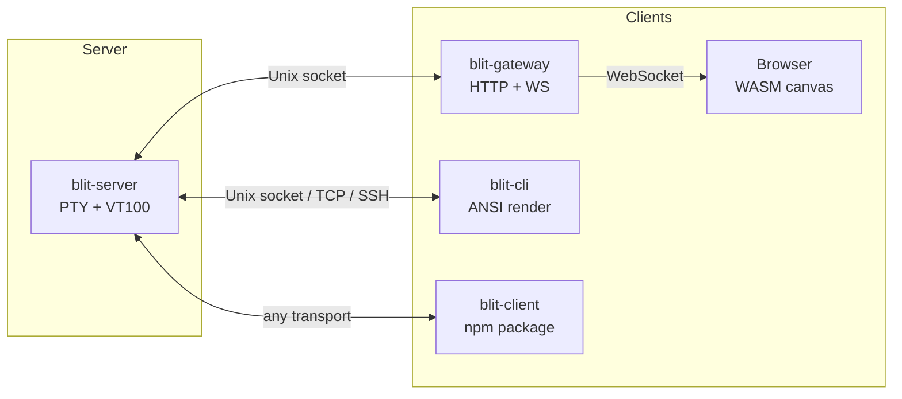

# blit

Low-latency terminal streaming. Multiplexes PTYs on a server, streams compressed updates to clients over any transport — browser, native terminal, or WASM.

Optimized for high-latency and low-bandwidth links (usable over 3G). 12-byte cells, LZ4 compression, dirty-state bitmasks, adaptive refresh rates, and a flow-control protocol that keeps long-haul pipes full without overwhelming slow clients.

## Architecture



**blit-server** manages PTYs with VT100 emulation (via `vt100` crate), tracks dirty cells, compresses updates with LZ4, and streams them over a Unix socket. Supports 100,000 rows of scrollback per PTY.

**blit-gateway** bridges WebSocket connections to the Unix socket and serves the browser UI. Embeds the compiled WASM and HTML in the binary. Authenticates with a passphrase.

**blit-cli** connects to the server from any terminal — over Unix socket (default), TCP, or SSH — and renders updates as ANSI escape sequences.

**blit-client** (npm package) provides the terminal state machine and protocol helpers as a WASM module, for embedding in VS Code extensions or other JS/TS applications.

## Install

### Nix (any platform)

```bash
# Run directly
nix run github:indent-com/blit                # blit-cli (default)
nix run github:indent-com/blit#blit-server
nix run github:indent-com/blit#blit-gateway

# Or install
nix profile install github:indent-com/blit
```

### APT (Debian/Ubuntu)

```bash
curl -fsSL https://indent-com.github.io/blit/blit.gpg | sudo gpg --dearmor -o /usr/share/keyrings/blit.gpg
echo "deb [signed-by=/usr/share/keyrings/blit.gpg] https://indent-com.github.io/blit stable main" \
  | sudo tee /etc/apt/sources.list.d/blit.list
sudo apt update
sudo apt install blit-server blit-gateway blit-cli
```

Packages are built for amd64 and arm64.

### Docker

```bash
docker build -t blit .
docker run -p 3264:3264 -e BLIT_PASS=secret blit
```

### npm (WASM library)

```bash
npm install blit-client
```

## Usage

### Quick start

```bash
# Terminal 1: start the server
blit-server

# Terminal 2: start the gateway
BLIT_PASS=secret blit-gateway
# Open http://localhost:3264 in a browser

# Or connect from a terminal
blit-cli
```

### blit-server

Manages PTYs and streams terminal state over a Unix socket.

```
blit-server
```

| Variable | Default | Description |
|---|---|---|
| `SHELL` | `/bin/sh` | Shell to spawn for new PTYs |
| `BLIT_SOCK` | `$XDG_RUNTIME_DIR/blit.sock` | Unix socket path |

Falls back to `/tmp/blit.sock` if `XDG_RUNTIME_DIR` is unset.

### blit-gateway

WebSocket proxy that bridges browser clients to the server. Serves the web UI with embedded WASM.

```
BLIT_PASS=secret blit-gateway
```

| Variable | Default | Description |
|---|---|---|
| `BLIT_PASS` | *(required)* | Authentication passphrase |
| `BLIT_ADDR` | `0.0.0.0:3264` | Listen address |
| `BLIT_SOCK` | `$XDG_RUNTIME_DIR/blit.sock` | Unix socket path |

### blit-cli

Terminal client. Connects to the server and renders in your terminal using ANSI sequences.

```bash
blit-cli                          # Unix socket (default)
blit-cli --socket /path/to.sock   # Explicit socket path
blit-cli --tcp host:3264          # TCP connection
blit-cli --ssh user@host          # SSH tunnel
blit-cli ssh -p 2222 user@host    # SSH with extra args
```

| Variable | Default | Description |
|---|---|---|
| `BLIT_SOCK` | `$XDG_RUNTIME_DIR/blit.sock` | Unix socket path |
| `BLIT_DISPLAY_FPS` | `240` | Target display refresh rate (10–1000) |

The SSH mode runs `nc -U` or `socat` on the remote host to bridge to the server's Unix socket.

### Browser

Navigate to the gateway address (default `http://localhost:3264`), enter the passphrase.

| Shortcut | Action |
|---|---|
| `Ctrl+Shift+T` | New tab |
| `Ctrl+Shift+W` | Close tab |
| `Ctrl+Shift+{` | Previous tab |
| `Ctrl+Shift+}` | Next tab |
| `Shift+PageUp/PageDown` | Scrollback |
| `Ctrl+?` | Toggle help |

Mouse selection copies as both plain text and styled HTML. Middle-click closes a tab. Scroll wheel moves through scrollback (or is forwarded to the terminal when mouse mode is active).

## WASM library (blit-client)

The `blit-client` npm package provides the terminal state machine and full protocol support, with no DOM or canvas dependencies. Designed for VS Code extensions, Electron apps, or any JS/TS environment.

```typescript
import { Terminal, parse_server_msg, msg_create, msg_input, msg_resize,
         msg_ack, S2C_UPDATE, S2C_TITLE, S2C_CREATED } from 'blit-client';

// Create a terminal
const term = new Terminal(24, 80);

// Build protocol messages to send to blit-server
const create = msg_create(24, 80);       // C2S_CREATE
const input = msg_input(0, bytes);        // C2S_INPUT
const resize = msg_resize(0, 30, 120);    // C2S_RESIZE

// Parse incoming server messages
const msg = parse_server_msg(data);
if (!msg) return;

switch (msg.kind()) {
  case S2C_UPDATE():
    term.feed_compressed(msg.payload());
    break;
  case S2C_TITLE():
    console.log(`PTY ${msg.pty_id()}: ${msg.title()}`);
    break;
  case S2C_CREATED():
    console.log(`PTY ${msg.pty_id()} created`);
    break;
}

// Read terminal state
console.log(term.get_all_text());
console.log(`Cursor: ${term.cursor_row}, ${term.cursor_col}`);
console.log(`Echo: ${term.echo()}, Mouse: ${term.mouse_mode()}`);
```

### API

**Terminal**

| Method | Description |
|---|---|
| `new Terminal(rows, cols)` | Create a terminal state machine |
| `feed_compressed(data)` | Apply a single LZ4-compressed update |
| `feed_compressed_batch(batch)` | Apply multiple length-prefixed compressed updates |
| `get_text(r0, c0, r1, c1)` | Extract text from a region |
| `get_all_text()` | Extract all text content |
| `get_cell(row, col)` | Raw 12-byte cell data |
| `.rows`, `.cols` | Terminal dimensions (update after feed) |
| `.cursor_row`, `.cursor_col` | Cursor position |
| `cursor_visible()` | Cursor visibility |
| `app_cursor()` | Application cursor key mode |
| `bracketed_paste()` | Bracketed paste mode |
| `mouse_mode()` | Mouse tracking mode (0=off) |
| `echo()` | Local echo enabled |

**Message builders**

| Function | Description |
|---|---|
| `msg_create(rows, cols)` | Create a PTY |
| `msg_input(pty_id, data)` | Send input to a PTY |
| `msg_resize(pty_id, rows, cols)` | Resize a PTY |
| `msg_focus(pty_id)` | Focus a PTY |
| `msg_close(pty_id)` | Close a PTY |
| `msg_ack()` | Acknowledge a frame |
| `msg_scroll(pty_id, offset)` | Set scrollback offset |
| `msg_display_rate(fps)` | Advertise display refresh rate |
| `msg_client_metrics(backlog, ack_ahead, apply_ms)` | Report client performance |

**Server message parser**

| Function / Method | Description |
|---|---|
| `parse_server_msg(data)` | Parse a binary server message |
| `msg.kind()` | Message type byte |
| `msg.pty_id()` | PTY ID |
| `msg.payload()` | Compressed frame (for `S2C_UPDATE`) |
| `msg.title()` | Title string (for `S2C_TITLE`) |
| `msg.pty_ids()` | PTY ID list (for `S2C_LIST`) |

## Protocol

All communication uses length-prefixed binary frames: 4 bytes little-endian length, then payload.

### Cell format (12 bytes)

```
[0]     flags:  fg_type(2) bg_type(2) bold(1) dim(1) italic(1) underline(1)
[1]     flags2: inverse(1) wide(1) wide_cont(1) content_len(3) reserved(2)
[2..5]  foreground color (r, g, b) — or indexed: r = palette index
[5..8]  background color (r, g, b) — or indexed: r = palette index
[8..12] content: up to 4 bytes of UTF-8
```

Color types (2 bits): 0 = default, 1 = indexed (256-color), 2 = RGB.

### Update payload

1. **Header** (10 bytes): rows(u16) cols(u16) cursor_row(u16) cursor_col(u16) mode(u16)
2. **Bitmask**: 1 bit per cell, marks which cells changed
3. **Cell data**: dirty cells in struct-of-arrays layout, LZ4 compressed with prepended size

The SoA layout groups byte 0 of all dirty cells, then byte 1, etc. — better compression than AoS since adjacent cells often share attributes.

### Flow control

Clients send `C2S_ACK` after consuming frames. The server queues up to 32 frames per client and pauses when unacknowledged frames exceed the window. Clients report metrics (backlog, ack-ahead count, apply time) so the server can adapt its send rate. This keeps high-RTT links saturated without overwhelming slow clients.

## Development

```bash
# Enter the dev shell
nix develop

# Build browser WASM
cd browser && wasm-pack build --target web --release --out-dir ../web

# Run
cargo run -p blit-server
BLIT_PASS=secret cargo run -p blit-gateway  # http://localhost:3264
cargo run -p blit-cli
```

### Nix packages

```bash
nix build .#blit-server       # Server binary
nix build .#blit-cli           # CLI binary
nix build .#blit-gateway       # Gateway binary (includes WASM)
nix build .#blit-client        # WASM npm package
nix build .#blit-server-deb    # Debian package (static musl)
nix build .#blit-cli-deb
nix build .#blit-gateway-deb
nix run .#npm-publish          # Publish blit-client to npm
nix run .#npm-publish -- --dry-run
```

### Release

Tag and push to trigger CI:

```bash
git tag v0.1.4
git push origin v0.1.4
```

This builds amd64 + arm64 .deb packages, creates a GitHub release, publishes to npm, and updates the APT repository on GitHub Pages.

## License

MIT
