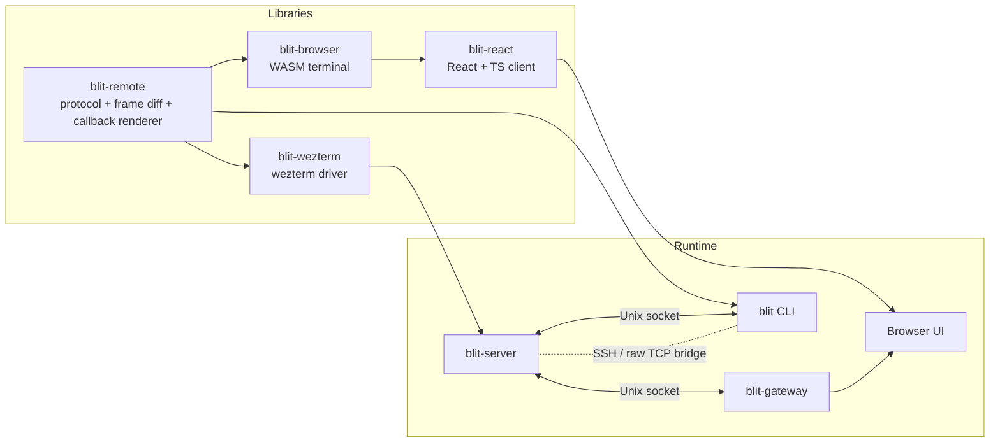

# blit

Terminal streaming for high-latency networks.

blit gives you a multiplexed terminal over a browser or native client that stays responsive on links where SSH falls apart — satellite hops, cross-continent VPNs, spotty mobile connections. If you've ever typed into a remote shell and waited a full second to see the character echo, blit is the fix.

It works for anyone who needs remote shells: ops engineers SSHing into production, developers on distant dev boxes, teams sharing terminal sessions. The browser UI runs anywhere with no install; the CLI gives you a native fallback. A React component lets you embed terminals in your own apps.

## Quick Start

### Local dev shell

```bash
nix develop
```

Inside the dev shell:

```bash
# Terminal 1
cargo run -p blit-server

# Terminal 2
cargo run -p blit-cli
```

`blit-cli` acts as a gateway in browser mode: it starts an HTTP/WebSocket server on a random loopback port, injects a session token into the served HTML, and opens the browser automatically. No passphrase prompt or separate `blit-gateway` process needed for local use.

Use `--console` for the ANSI terminal renderer instead:

```bash
cargo run -p blit-cli -- --console
```

If you use `direnv`, `.envrc` already wires the flake and adds the local `bin/` scripts to `PATH`.

### Auto-reload loop

```bash
nix develop
dev
```

`dev` runs `process-compose.yml`, which starts:

- browser JS/WASM asset rebuilds under `cargo watch`
- `blit-server` under `cargo watch`
- `blit-gateway` under `cargo watch`

## Workspace

### Binaries

- `blit-server`: PTY host and frame producer
- `blit-gateway`: HTTP/WebSocket gateway for browsers
- `blit` / `blit-cli`: terminal client and embedded gateway (browser mode) or ANSI renderer (console mode)
- `blit-demo`: local demos

### Libraries

- `blit-remote`: protocol, frame diffs, terminal state decode, and callback/DOM rendering
- `blit-wezterm`: wezterm-backed terminal driver
- `blit-browser`: browser renderer/WASM module (`browser/`)
- `blit-react`: React component and TypeScript client library with injectable transport (`react/`)

## Architecture



### How data flows

**Server side.** `blit-server` owns PTYs and terminal state. When a PTY produces output, the wezterm parser (`blit-wezterm`) interprets escape sequences and updates an in-memory cell grid. The server then diffs this grid against what each client last received, producing a compact binary frame: 12-byte cells (style flags, fg/bg color, up to 4 bytes of UTF-8 content), LZ4-compressed, with per-client delta tracking. Only changed cells are sent.

**Transport.** The server exposes a Unix socket. `blit-gateway` bridges that socket to HTTP/WebSocket for browser clients, handling authentication and serving the static web assets. The `blit` CLI can either connect directly to the socket (local) or tunnel it over SSH (`-L` forwarding) and spin up an embedded gateway on a random loopback port. Clients and server exchange a binary protocol of tagged messages (`C2S_INPUT`, `C2S_RESIZE`, `S2C_UPDATE`, etc.) — no JSON, no text framing.

**Client side.** The browser receives compressed frame diffs over WebSocket and feeds them to a WASM terminal state machine (`blit-browser`). Rendering is WebGL: glyphs are rasterized into a texture atlas at the device-pixel cell size, then drawn as textured quads. Background colors and cursor are separate draw calls. The 2D canvas composites the WebGL surface with overflow text (emoji, wide Unicode) and predicted input. The React component (`blit-react`) wraps the same WASM module with transport injection, so you can swap WebSocket for WebRTC or anything else.

### Why server and gateway are separate

The server is a long-lived per-user daemon (often socket-activated by systemd) that manages PTY lifetimes and scrollback. The gateway is a stateless HTTP proxy that can be restarted, load-balanced, or run behind a reverse proxy without losing terminal sessions. For local use, the CLI embeds the gateway, so you only run one process.

### Wire format

Each cell is 12 bytes: 2 bytes of flags (color type, bold, dim, italic, underline, inverse, wide, content length), 3 bytes foreground, 3 bytes background, 4 bytes UTF-8 content. Frames are LZ4-compressed diffs — only cells that changed since the client's last-acknowledged frame. The client reports display metrics (backlog depth, render time, display refresh rate) so the server can pace frame production and drop frames when the client can't keep up. Flow control uses explicit ACK counting rather than TCP backpressure alone, which is what makes it work on high-RTT links.

## Runtime Guide

### `blit-server`

The server manages PTYs, tracks terminal state, and publishes updates over a Unix socket.

The server uses the `wezterm` parser backend.

```bash
blit-server
blit-server --socket /tmp/blit.sock
```

| Variable          | Default                                          | Description                                        |
| ----------------- | ------------------------------------------------ | -------------------------------------------------- |
| `SHELL`           | `/bin/sh`                                        | Shell to spawn for new PTYs                        |
| `BLIT_SOCK`       | `$XDG_RUNTIME_DIR/blit.sock` or `/tmp/blit.sock` | Unix socket path (ignored under socket activation) |
| `BLIT_SCROLLBACK` | `10000`                                          | Scrollback rows per PTY                            |

#### systemd socket activation

The server supports `LISTEN_FDS=1` for systemd-style socket activation. Each user gets a socket at `/run/blit/<user>.sock` that starts the server on first connection.

**NixOS** — add the flake input and enable the module:

```nix
# flake.nix
{
  inputs.blit.url = "github:indent-com/blit";
}

# configuration.nix
{ inputs, ... }: {
  imports = [ inputs.blit.nixosModules.blit ];

  services.blit = {
    enable = true;
    users = [ "alice" "bob" ];
    # shell = "/run/current-system/sw/bin/fish";  # optional
    # scrollback = 20000;                         # optional, default 10000
    gateways.alice = {
      user = "alice";
      port = 3264;
      passFile = "/run/secrets/blit-alice-pass"; # file containing BLIT_PASS=...
    };
  };
}
```

**Other distros** — install the systemd template units:

```bash
sudo cp systemd/blit@.socket systemd/blit@.service /etc/systemd/system/
sudo systemctl daemon-reload
sudo systemctl enable --now blit@alice.socket
```

Either way, from any machine:

```bash
blit alice@myhost    # opens browser, SSH forwards to /run/blit/alice.sock
```

The `blit-server-deb` package ships these unit files in `/lib/systemd/system/`.

**macOS (nix-darwin):**

```nix
# flake.nix
{
  inputs.blit.url = "github:indent-com/blit";
}

# darwin-configuration.nix
{ inputs, ... }: {
  imports = [ inputs.blit.darwinModules.blit ];

  services.blit = {
    enable = true;
    # shell = "/run/current-system/sw/bin/fish";  # optional
    # socketPath = "/tmp/blit.sock";              # default
    gateways.default = {
      port = 3264;
      passFile = "/path/to/blit-pass-env";  # file containing BLIT_PASS=...
    };
  };
}
```

This creates launchd user agents for `blit-server` (with `KeepAlive`) and each gateway. Logs go to `/tmp/blit-server.log` and `/tmp/blit-gateway-*.log`.

### `blit-gateway`

The gateway serves the browser UI and proxies WebSocket traffic to the server's Unix socket. Use it for always-on deployments where the gateway must run independently of the CLI — for example, behind a reverse proxy or as a systemd service. For local and SSH use, the `blit` CLI embeds equivalent gateway functionality and is simpler to run.

```bash
BLIT_PASS=secret blit-gateway
BLIT_PASS=secret BLIT_ADDR=127.0.0.1:3264 blit-gateway
```

| Variable    | Default                                                                          | Description                   |
| ----------- | -------------------------------------------------------------------------------- | ----------------------------- |
| `BLIT_PASS` | required                                                                         | Browser passphrase            |
| `BLIT_ADDR` | `0.0.0.0:3264`                                                                   | HTTP/WebSocket listen address |
| `BLIT_SOCK` | `/run/blit/$USER.sock`, then `$XDG_RUNTIME_DIR/blit.sock`, then `/tmp/blit.sock` | Upstream server socket        |

### `blit`

Without `--console`, `blit` acts as an embedded gateway: it starts an HTTP/WebSocket server on a random loopback port, injects a one-time session token into the served HTML (no passphrase prompt), and opens the browser. A bare hostname is treated as an SSH target; SSH connections are multiplexed over a single TCP connection using `-L` Unix socket forwarding (no `nc` or `socat` needed on the remote).

With `--console`, it renders directly to the terminal using the ANSI renderer.

```bash
blit                        # local server, browser UI (embedded gateway)
blit myhost                 # SSH to myhost, browser UI
blit user@host              # SSH with explicit user
blit --console              # local server, terminal renderer
blit --console myhost       # SSH to myhost, terminal renderer
blit --socket /path.sock    # explicit Unix socket
blit --tcp host:9000        # raw TCP
```

Each browser tab gets its own connection to the blit-server.

| Variable           | Default                                                                          | Description                                                           |
| ------------------ | -------------------------------------------------------------------------------- | --------------------------------------------------------------------- |
| `BLIT_SOCK`        | `/run/blit/$USER.sock`, then `$XDG_RUNTIME_DIR/blit.sock`, then `/tmp/blit.sock` | Unix socket path                                                      |
| `BLIT_DISPLAY_FPS` | `240`                                                                            | Advertised client display rate (console mode), clamped to `10..=1000` |

### Browser UI

Open the gateway address, enter the passphrase, and the browser keeps one lead terminal at full size.

Press `Ctrl/Cmd+K` to open Expose. It shows live PTY previews, searches titles as you type, lets you switch with `Enter`, arrow keys, or a click, and includes a `+` button to open a new PTY. `Ctrl+Shift+B` toggles backlog for the focused PTY.

Shortcuts:

| Shortcut                          | Action                                                     |
| --------------------------------- | ---------------------------------------------------------- |
| `Ctrl`/`Cmd`+`K`                  | Open Expose / switch PTY                                   |
| `Ctrl`/`Cmd`+`Shift`+`K`          | Palette picker                                             |
| `Ctrl`/`Cmd`+`Shift`+`Enter`      | New PTY in focused PTY's cwd (falls back to shell default) |
| `Ctrl+Shift+W`                    | Close focused PTY                                          |
| `Ctrl+Shift+B`                    | Toggle backlog                                             |
| `Ctrl+Shift+H`                    | Toggle HUD (size/fps/kbps)                                 |
| `Ctrl+Shift+{` / `Ctrl+Shift+}`   | Previous / next PTY                                        |
| `Shift+PageUp` / `Shift+PageDown` | Scrollback                                                 |
| `Ctrl+Shift+/`                    | Toggle help                                                |

Mouse behavior:

- Selection copies both `text/plain` and `text/html`
- Wheel scrolls scrollback unless the PTY has mouse mode enabled, in which case the event is forwarded

## React Component

The `blit-react` package (`react/`) embeds a blit terminal in any React app. It includes the full TypeScript protocol layer, WebGL renderer, and keyboard encoding — no separate WASM client package needed. Networking is an injected dependency — bring your own transport.

### Quick start

```tsx
import {
  BlitProvider,
  BlitTerminal,
  WebSocketTransport,
  TerminalStore,
  useBlitSessions,
} from "blit-react";
import { useRef } from "react";

function App({ wasm }) {
  const transport = useRef(
    new WebSocketTransport("wss://myhost:3264/", "secret"),
  ).current;
  const store = useRef(new TerminalStore(transport, wasm)).current;
  const { sessions } = useBlitSessions(transport, {
    autoCreateIfEmpty: true,
  });
  const active = sessions.find((s) => s.state === "active");

  return (
    <BlitProvider transport={transport} store={store}>
      <BlitTerminal
        ptyId={active?.ptyId ?? null}
        style={{ width: "100%", height: "100vh" }}
      />
    </BlitProvider>
  );
}
```

### `<BlitProvider>`

Context provider that eliminates prop drilling. Child components (`BlitTerminal`, `useBlitSessions`) read `transport`, `store`, `palette`, `fontFamily`, and `fontSize` from context when props are omitted.

```tsx
<BlitProvider transport={transport} store={store} palette={nord} fontFamily="monospace" fontSize={14}>
  {/* BlitTerminal and hooks read from context automatically */}
</BlitProvider>
```

### `TerminalStore`

Centralized WASM terminal lifecycle manager. Owns terminal instances, subscriptions, and frame processing.

```ts
import { TerminalStore } from "blit-react";

// Pass a pre-initialized WASM module (sync) or a promise (async)
const store = new TerminalStore(transport, wasmModule);
const store = new TerminalStore(transport, initWasm()); // promise also works
```

### `useBlitSessions`

Manages the session lifecycle: LIST, CREATED, CLOSED, and TITLE parsing. Returns reactive state and control functions. The `transport` argument is optional when a `BlitProvider` is present.

```ts
const { ready, sessions, status, createPty, focusPty, closePty } =
  useBlitSessions(transport, {
    autoCreateIfEmpty: true,
    getInitialSize: () => ({ rows: 24, cols: 80 }),
  });
```

| Field       | Type                     | Description                                                 |
| ----------- | ------------------------ | ----------------------------------------------------------- |
| `ready`     | `boolean`                | `true` after the first LIST is received.                    |
| `sessions`  | `readonly BlitSession[]` | Current sessions with `ptyId`, `tag`, `title`, and `state`. |
| `status`    | `ConnectionStatus`       | Transport connection status.                                |
| `createPty` | `(opts?) => Promise<number>` | Create a PTY. Accepts `{ rows?, cols?, command?, tag?, srcPtyId? }`. |
| `focusPty`  | `(ptyId) => void`        | Focus a PTY on the server.                                  |
| `closePty`  | `(ptyId) => Promise<void>` | Close a PTY.                                              |

### `<BlitTerminal>`

Renders a single PTY. Owns RESIZE, INPUT, SCROLL, mouse/keyboard encoding, and WebGL rendering. All props except `ptyId` fall back to `BlitProvider` context.

| Prop         | Type              | Description                                                           |
| ------------ | ----------------- | --------------------------------------------------------------------- |
| `ptyId`      | `number \| null`  | **Required.** PTY to display. `null` = waiting for a PTY.             |
| `transport`  | `BlitTransport`   | Falls back to context, then `store.transport`.                        |
| `store`      | `TerminalStore`   | Falls back to context. Required via one or the other.                 |
| `fontFamily` | `string`          | CSS font family. Default: `"ui-monospace, monospace"`    |
| `fontSize`   | `number`          | Font size in CSS pixels. Default: `13`                                |
| `className`  | `string`          | CSS class for the container div.                                      |
| `style`      | `CSSProperties`   | Inline styles for the container div.                                  |
| `palette`    | `TerminalPalette` | Color palette (fg, bg, 16 ANSI colors). See `PALETTES` for built-ins. |
| `readOnly`   | `boolean`         | Render-only mode: no input, resize, or scroll commands sent.          |

### Imperative handle

```tsx
const termRef = useRef<BlitTerminalHandle>(null);

<BlitTerminal ref={termRef} ptyId={ptyId} />;

termRef.current?.focus(); // focus the input sink
termRef.current?.terminal; // underlying WASM Terminal instance
termRef.current?.rows; // current grid dimensions
termRef.current?.cols;
termRef.current?.status; // 'connecting' | 'connected' | ...
```

### Palettes

Ten built-in palettes are exported as `PALETTES`. Each has an `id`, `name`, `dark` flag, and `fg`/`bg`/`ansi` color arrays (RGB 0–255):

```tsx
import { BlitTerminal, PALETTES } from "blit-react";
import type { TerminalPalette } from "blit-react";

// Use a built-in palette
const nord = PALETTES.find((p) => p.id === "nord")!;
<BlitTerminal transport={t} ptyId={id} palette={nord} />;

// Build your own
const custom: TerminalPalette = {
  id: "my-theme",
  name: "My Theme",
  dark: true,
  fg: [200, 200, 200],
  bg: [20, 20, 20],
  ansi: [
    /* 16 × [r,g,b] entries */
  ],
};
```

Available built-in IDs: `default`, `solarized-dark`, `solarized-light`, `dracula`, `one-dark`, `nord`, `gruvbox-dark`, `gruvbox-light`, `catppuccin`, `tokyo-night`, `tomorrow`, `tomorrow-night`, `tomorrow-night-midnight`.

The `dark` field is informational — use it to sync surrounding UI (e.g. set a CSS `color-scheme`). It does not affect rendering.

### Transport interface

Implement `BlitTransport` for any binary channel:

```ts
interface BlitTransport {
  send(data: Uint8Array): void;
  close(): void;
  readonly status: ConnectionStatus;
  addEventListener(type: "message", listener: (data: ArrayBuffer) => void): void;
  addEventListener(type: "statuschange", listener: (status: ConnectionStatus) => void): void;
  removeEventListener(type: "message", listener: (data: ArrayBuffer) => void): void;
  removeEventListener(type: "statuschange", listener: (status: ConnectionStatus) => void): void;
}
```

Two transports are included:

**`WebSocketTransport`** — authenticating WebSocket with auto-reconnect:

```ts
import { WebSocketTransport } from "blit-react";

const transport = new WebSocketTransport("wss://myhost:3264/", "secret", {
  reconnect: true,
  reconnectDelay: 500,
  maxReconnectDelay: 10000,
  reconnectBackoff: 1.5,
});
```

**`createWebRtcDataChannelTransport`** — WebRTC data channel with 4-byte frame envelope:

```ts
import { createWebRtcDataChannelTransport } from "blit-react";

const transport = createWebRtcDataChannelTransport(peerConnection, {
  label: "blit",
  displayRateFps: 120,
  connectTimeoutMs: 10000,
});

await transport.waitForSync();
```

### Hooks and utilities

For custom UIs that don't use the built-in `<BlitTerminal>`:

- **`useBlitSessions(transport?, options?)`** — manages session lifecycle. Transport falls back to context.
- **`useBlitConnection(transport, callbacks)`** — low-level server message parsing. Returns `sendInput`, `sendResize`, `sendCreate2`, `sendFocus`, `sendClose`, `sendSubscribe`, `sendUnsubscribe`, `sendScroll`, `sendAck`, `sendSearch`, and `status`.
- **`measureCell(fontFamily, fontSize)`** — measures cell dimensions snapped to device pixels.

### Protocol builders

Pure functions for building wire-format messages, useful for custom transports or testing:

```ts
import {
  buildInputMessage,
  buildResizeMessage,
  buildScrollMessage,
  buildCreate2Message,
  buildFocusMessage,
  buildCloseMessage,
  buildSubscribeMessage,
  buildUnsubscribeMessage,
  buildSearchMessage,
  buildAckMessage,
} from "blit-react";

const msg = buildInputMessage(ptyId, new TextEncoder().encode("ls\r"));
transport.send(msg);
```

### Low-level exports

For advanced use cases (custom renderers, non-React apps):

- **`createGlRenderer(canvas)`** — creates the WebGL terminal renderer used internally by `BlitTerminal`.
- **`keyToBytes(event, appCursor)`** — encodes a `KeyboardEvent` into terminal byte sequences.

## Callback Rendering

`blit-remote` can render a last-known screen from a callback-driven DOM model, then diff and transmit that frame over the same transport used by the terminal path.

```rust
use blit_remote::{CallbackRenderer, CellStyle, Rect};

let mut renderer = CallbackRenderer::new(24, 80);
renderer.render(|dom| {
    dom.set_title("dashboard");
    dom.wrapped_text(
        Rect::new(0, 0, 3, 80),
        "Status text without a terminal parser",
        CellStyle::default(),
    );
    dom.scrolling_text(
        Rect::new(4, 0, 20, 80),
        ["line 1", "line 2", "line 3"],
        0,
        CellStyle::default(),
    );
});
```

## Building And Packaging

### Browser assets

```bash
./bin/build-browser
```

### Nix packages

```bash
nix build .#blit-server
nix build .#blit-cli
nix build .#blit-gateway
nix build .#blit-server-deb
nix build .#blit-cli-deb
nix build .#blit-gateway-deb
```

### npm publish

```bash
nix run .#browser-publish -- --dry-run    # blit-browser
nix run .#browser-publish
nix run .#react-publish -- --dry-run      # blit-react
nix run .#react-publish
```
