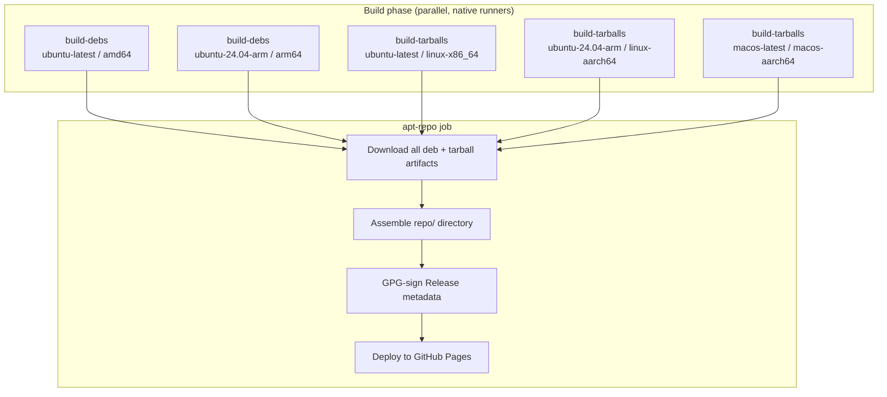
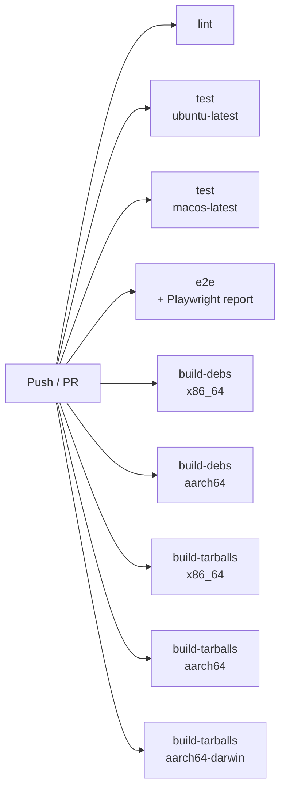
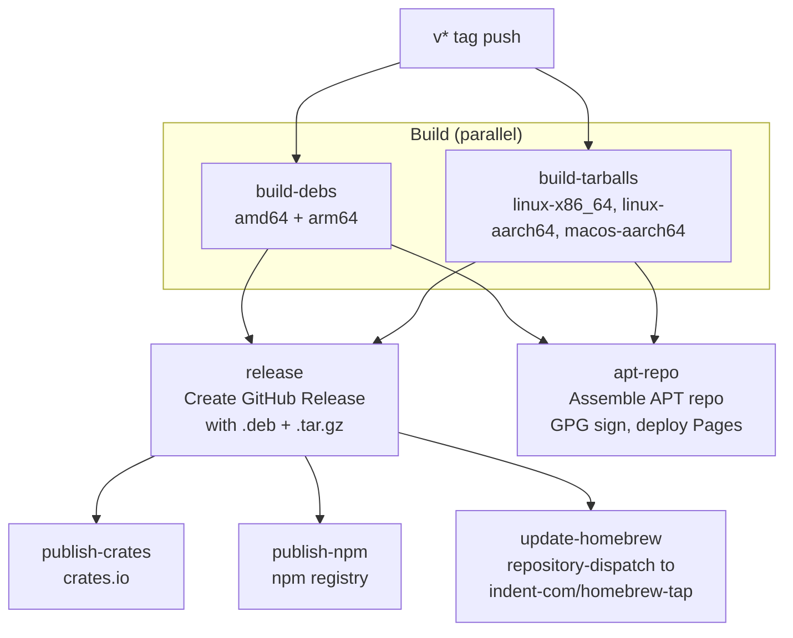
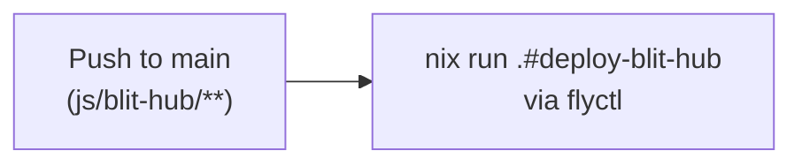
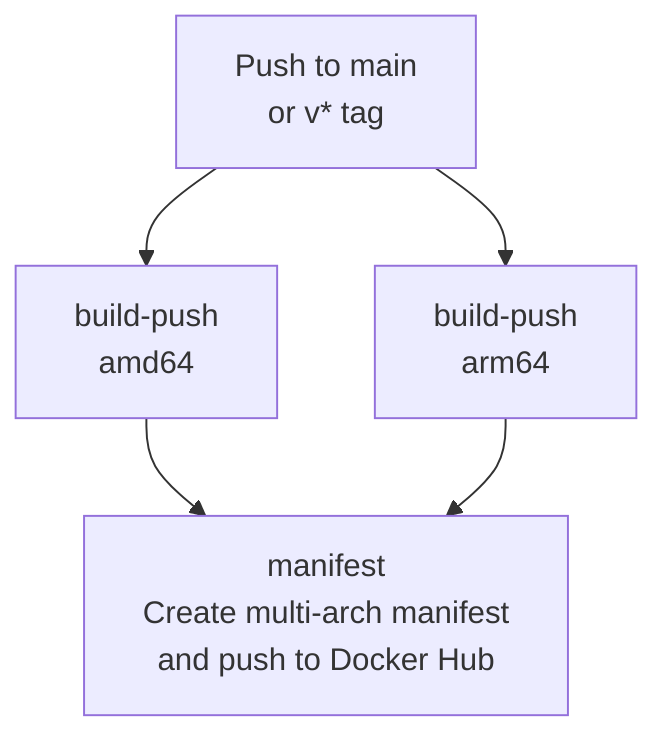
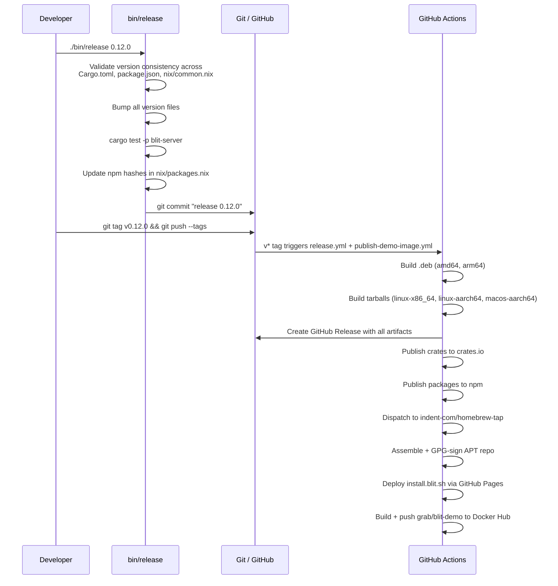

# Services

This document describes the hosted services and CI/CD infrastructure that support blit. For the system architecture, see [ARCHITECTURE.md](ARCHITECTURE.md). For development workflow, see [CONTRIBUTING.md](CONTRIBUTING.md).

## install.blit.sh

`install.blit.sh` is an APT repository and binary download site hosted on **GitHub Pages**. It is rebuilt and deployed on every tagged release (`v*`). Users interact with it in three ways:

1. **Curl installer** — `curl https://install.blit.sh | sh` fetches the install script (served as `index.html`), which detects OS/arch, downloads the right tarball from `/bin/`, and installs it.
2. **APT repository** — Debian/Ubuntu users add it as a signed APT source for `apt install blit`.
3. **Direct download** — tarballs are available at `/bin/blit_<version>_<os>_<arch>.tar.gz`.

### File hierarchy

```
install.blit.sh/
  index.html              # install.sh (curl installer served as the landing page)
  latest                  # plain-text file containing the current version (e.g. "0.12.0")
  blit.gpg                # GPG public key for APT signature verification
  bin/
    blit_0.12.0_linux_x86_64.tar.gz
    blit_0.12.0_linux_aarch64.tar.gz
    blit_0.12.0_darwin_aarch64.tar.gz
  pool/
    blit_0.12.0_amd64.deb
    blit_0.12.0_arm64.deb
  dists/stable/
    Release               # APT release metadata
    Release.gpg            # detached GPG signature
    InRelease              # clearsigned release
    main/binary-amd64/
      Packages             # APT package index
      Packages.gz
    main/binary-arm64/
      Packages
      Packages.gz
```

### How the install script works

[`install.sh`](install.sh) is a portable POSIX shell script that:

1. Detects OS (`uname -s`) and architecture (`uname -m`), normalizing to `linux`/`darwin` and `x86_64`/`aarch64`.
2. Fetches `/latest` from `install.blit.sh` to get the current version.
3. Skips if the installed version already matches.
4. Downloads the tarball from `/bin/blit_<version>_<os>_<arch>.tar.gz`.
5. Extracts and installs to `$BLIT_INSTALL_DIR` (default `/usr/local/bin`), escalating with `sudo`/`doas` if needed.

### `blit upgrade`

`blit upgrade` is the in-place self-update command. It fetches `install.sh` from `https://install.blit.sh`, writes it to a temp file, and `exec`s `sh` with `BLIT_INSTALL_DIR` set to the directory of the currently running binary. This way the new version replaces the old one in the same location regardless of how it was originally installed. See [`crates/cli/src/main.rs`](crates/cli/src/main.rs).

### How the site is built

The `apt-repo` job in the release workflow assembles the entire site from build artifacts, signs the APT metadata with GPG, and deploys via GitHub Pages:



## hub.blit.sh

`hub.blit.sh` is the WebRTC signaling relay that enables `blit share`. It runs on **Fly.io** and is deployed automatically when code under `js/blit-hub/` changes on `main`.

The hub routes WebRTC signaling messages (offers, answers, ICE candidates) between peers over WebSocket. Channels are identified by ed25519 public keys, and the server verifies NaCl `crypto_sign` envelopes before relaying — no server-side accounts needed.

For protocol details, deployment instructions, and configuration, see [`js/blit-hub/README.md`](js/blit-hub/README.md).

### Architecture

- **Bun** runtime with `Bun.serve()` for HTTP and WebSocket
- **Redis** for cross-instance pub/sub and session tracking (sets with TTL)
- **tweetnacl** for ed25519 signature verification
- Stateless — all session state lives in Redis, so instances scale horizontally

### Endpoints

| Path | Purpose |
| --- | --- |
| `/channel/<pubkey>/<producer\|consumer>` | WebSocket upgrade for signaling |
| `/ice` | STUN/TURN server config (Cloudflare TURN if configured) |
| `/message` | Session URL template for client display |
| `/health` | Liveness check (pings Redis) |

## Static binaries via Nix + musl

All release binaries are built with Nix, which makes the entire toolchain reproducible and keeps the build definitions small.

On Linux, binaries are statically linked against **musl libc** via `pkgs.pkgsStatic`. Nix's `pkgsStatic` overlay cross-compiles the entire dependency closure against musl, producing fully self-contained executables with zero runtime dependencies — no glibc version issues, no `LD_LIBRARY_PATH`, works on any Linux kernel from the past decade. The `mkStaticBin` helper in [`nix/packages.nix`](nix/packages.nix) wraps this and includes a `postFixup` assertion that the output is genuinely statically linked (via `file`), failing the build if it isn't.

On macOS, true static linking isn't practical (Apple doesn't ship static system libraries). Instead, `postFixup` rewrites any nix-store dylib references to their `/usr/lib/` equivalents (`libSystem`, `libc++`, `libresolv`, etc.) using `install_name_tool`, so the binary runs on stock macOS without Nix installed.

The Rust toolchain is configured with musl targets (`x86_64-unknown-linux-musl`, `aarch64-unknown-linux-musl`) in [`nix/common.nix`](nix/common.nix). The same toolchain also includes `wasm32-unknown-unknown` for the browser WASM build.

This means the tarballs on `install.blit.sh/bin/` and the binaries inside `.deb` packages are single-file, zero-dependency executables — download, `chmod +x`, run.

## GitHub Actions workflows

Four workflow files live in `.github/workflows/`:

| Workflow | Trigger | Purpose |
| --- | --- | --- |
| [`test.yml`](.github/workflows/test.yml) | Push to `main`, PRs | Lint, test, e2e, verify builds |
| [`release.yml`](.github/workflows/release.yml) | `v*` tag push | Build artifacts, create GitHub Release, publish packages, deploy install site |
| [`deploy-blit-hub.yml`](.github/workflows/deploy-blit-hub.yml) | Push to `main` (paths: `js/blit-hub/**`) | Deploy signaling hub to Fly.io |
| [`publish-demo-image.yml`](.github/workflows/publish-demo-image.yml) | Push to `main`, `v*` tag | Build and push `grab/blit-demo` Docker image |

### CI (test.yml)

Runs on every push to `main` and on every pull request. All jobs run in parallel:



| Job | Runner | What it does |
| --- | --- | --- |
| `lint` | ubuntu-latest | `./bin/lint` — clippy, rustfmt, TS checks |
| `test` | ubuntu-latest, macos-latest | `./bin/tests` — `cargo test --workspace` |
| `e2e` | ubuntu-latest | `./bin/e2e` — Playwright against the full stack; uploads report artifact |
| `build-debs` | ubuntu-latest, ubuntu-24.04-arm | Verify `.deb` packages build (amd64 + arm64) |
| `build-tarballs` | ubuntu-latest, ubuntu-24.04-arm, macos-latest | Verify static tarballs build (3 platforms) |

### Release (release.yml)

Triggered by pushing a `v*` tag (created by `./bin/release <version>`):



| Job | Depends on | What it does |
| --- | --- | --- |
| `build-debs` | — | Nix-build `.deb` packages on native amd64 + arm64 runners |
| `build-tarballs` | — | Nix-build static tarballs on 3 platform runners |
| `release` | build-debs, build-tarballs | Downloads all artifacts, creates a GitHub Release with auto-generated notes |
| `publish-crates` | release | `./bin/publish-crates` — publishes workspace crates to crates.io |
| `publish-npm` | release | `./bin/publish-npm-packages` — publishes blit-react + blit-browser to npm |
| `update-homebrew` | release | Sends a `repository-dispatch` event to `indent-com/homebrew-tap` with the new version |
| `apt-repo` | build-debs, build-tarballs | Assembles the APT repo directory, GPG-signs metadata, deploys to GitHub Pages |

### Deploy blit-hub (deploy-blit-hub.yml)

Single job, triggered only when files under `js/blit-hub/` change on `main`:



### Publish demo image (publish-demo-image.yml)

Builds and pushes `grab/blit-demo` to Docker Hub. Runs on pushes to `main` and on `v*` tags. Tagged releases get an additional version tag.



## Release lifecycle

End-to-end flow from version bump to published artifacts:



## Secrets and authentication

| Secret | Used by | Purpose |
| --- | --- | --- |
| `GPG_PRIVATE_KEY` | apt-repo | Signs APT Release metadata |
| `HOMEBREW_TAP_TOKEN` | update-homebrew | PAT for cross-repo dispatch to homebrew-tap |
| `FLY_API_TOKEN` | deploy-blit-hub | Fly.io deploy token for blit-hub |
| `DOCKERHUB_USERNAME` | publish-demo-image | Docker Hub credentials |
| `DOCKERHUB_TOKEN` | publish-demo-image | Docker Hub credentials |

`publish-crates` uses no stored secret. It authenticates to crates.io via OIDC trusted publishing — GitHub mints a short-lived ID token (enabled by the `id-token: write` permission on the release workflow) and exchanges it for a crates.io upload token. `publish-npm` works the same way, using `--provenance` to sign the npm package with the workflow's OIDC identity.
