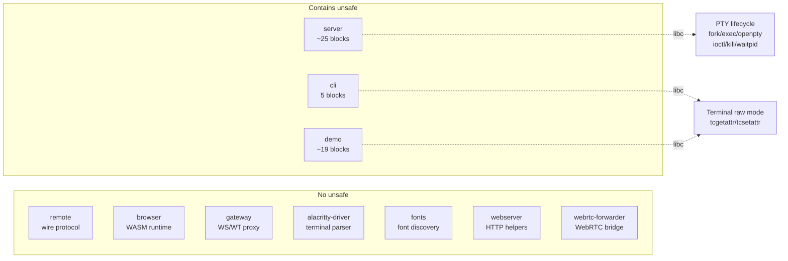

# Unsafe code in blit

This document maps all `unsafe` usage in the project. The goal is to make it easy to audit: where unsafe code lives, why it exists, and which crates are entirely safe.

## Overview

Most of the codebase is safe Rust. Unsafe code is confined to three crates that need direct access to POSIX terminal and process APIs. The remaining crates (`remote`, `browser`, `gateway`, `alacritty-driver`, `fonts`, `webserver`, `webrtc-forwarder`) contain zero `unsafe` blocks.



## Safe crates

These crates have no `unsafe` code at all:

| Crate | Role | Why it stays safe |
| --- | --- | --- |
| `remote` | Wire protocol, frame state, cell encoding | Pure data transformation — no I/O, no FFI |
| `browser` | WASM terminal runtime, WebGL vertex data | Runs in browser sandbox; wasm-bindgen handles FFI |
| `gateway` | WebSocket/WebTransport proxy | Built on axum/tokio — all safe async I/O |
| `alacritty-driver` | Terminal parsing via `alacritty_terminal` | Wraps a safe Rust library |
| `fonts` | Font discovery and TTF/OTF metadata | File I/O through `std::fs` |
| `webserver` | Shared axum HTTP helpers | Thin wrappers around safe libraries |
| `webrtc-forwarder` | WebRTC signaling bridge | WebSocket relay, no low-level system calls |

## Unsafe crates

### `server` (~25 unsafe blocks)

[`crates/server/src/lib.rs`](crates/server/src/lib.rs) is the most unsafe-heavy file. All unsafe code exists because the server manages PTY lifecycle directly through POSIX APIs — there are no safe Rust abstractions for `openpty`, `fork`/`execvp`, or fd-passing over Unix sockets.

**PTY allocation and process spawning** (`spawn_pty`, `spawn_pty_simple`):

```
openpty() -> fork() -> child: setsid/ioctl(TIOCSCTTY)/dup2/chdir/execvp
                    -> parent: close(slave)/fcntl(O_NONBLOCK)
```

- `openpty` allocates a master/slave PTY pair.
- `fork` + `execvp` spawns the child shell or command.
- The child calls `setsid`, sets the controlling terminal with `ioctl(TIOCSCTTY)`, redirects stdio with `dup2`, and execs.
- The parent closes the slave fd and sets the master to non-blocking.

**PTY I/O**:
- `pty_write_all` — `libc::write` to the master fd (sends keystrokes to the shell).
- `pty_reader` — `libc::read` from the master fd in a blocking loop (reads shell output).

**Resize**:
- `ioctl(TIOCSWINSZ)` sets the terminal size, then `kill(-pgid, SIGWINCH)` notifies the foreground process group.

**Process cleanup** (`cleanup_pty`):
- `kill(pid, SIGHUP)` signals the child, `close(master_fd)` closes the PTY, `waitpid(WNOHANG)` reaps without blocking.
- A background zombie reaper calls `waitpid(-1, WNOHANG)` every 5 seconds to catch any children the per-PTY cleanup missed.

**Terminal state queries**:
- `tcgetattr` reads line discipline flags (ECHO, ICANON) to detect password prompts.
- macOS-only `proc_pidinfo(PROC_PIDVNODEPATHINFO)` gets the child's working directory.

**Raw fd ownership**:
- `from_raw_fd` wraps fds received via `recvmsg` (SCM_RIGHTS fd-passing) or inherited from systemd socket activation (fd 3).

**FFI**:
- macOS-only `pthread_set_qos_class_self_np` — sets the thread QoS class to `USER_INTERACTIVE` for lower scheduling latency. Not exposed by the `libc` crate.

### `cli` (5 unsafe blocks)

[`crates/cli/src/interactive.rs`](crates/cli/src/interactive.rs) uses unsafe for terminal raw mode in the console TUI:

| Function | Calls | Purpose |
| --- | --- | --- |
| `term_size()` | `ioctl(TIOCGWINSZ)` | Query terminal dimensions |
| `RawMode::enter()` | `tcgetattr` / `cfmakeraw` / `tcsetattr` | Switch stdin to raw mode (no echo, no line buffering) |
| `Drop for RawMode` | `tcsetattr` | Restore original terminal settings |
| `Drop for Cleanup` | `libc::write` | Emit reset escape sequences during drop (avoids `BufWriter` lock) |
| `write_all_stdout()` | `libc::write` | Unbuffered stdout write for frame output |

The raw `libc::write` calls exist because `std::io::stdout().write()` takes a lock, which can deadlock or panic inside a `Drop` impl or signal-adjacent code path.

### `demo` (~19 unsafe blocks across 4 binaries)

The demo programs in [`crates/demo/`](crates/demo/) duplicate the same terminal raw mode pattern from `cli` (ioctl, tcgetattr/tcsetattr, read, write) since they are standalone binaries with no shared dependency on the cli crate.

Notable additions beyond the standard pattern:

- **`emojiblast`** registers C signal handlers via `libc::signal()` with a function pointer cast, and calls only async-signal-safe functions (`write`, `_exit`) inside the handler.
- **`netdash`** uses `libc::poll()` for socket readiness polling with timeouts.

## Why not use safe abstractions?

Several crates exist for PTY management (`nix`, `pty-process`, `portable-pty`) and terminal raw mode (`crossterm`, `termion`). blit uses raw libc calls instead because:

1. The server needs precise control over the fork/exec sequence — `setsid`, controlling terminal assignment, fd inheritance, and signal group management must happen in a specific order.
2. The fd-passing protocol (`recvmsg`/`sendmsg` with `SCM_RIGHTS`) is not covered by higher-level crates.
3. The zombie reaper intentionally races with per-PTY `waitpid` — this requires understanding the exact semantics of `WNOHANG` and process group IDs.
4. The demo binaries are intentionally self-contained single-file programs; pulling in a terminal library would add dependencies for a handful of libc calls.

## Audit checklist

When modifying unsafe code in this project:

- **fd leaks** — every `openpty`/`dup2`/`close` sequence must close all fds on every error path, including in the child after a failed `execvp`.
- **Signal safety** — code in `Drop` impls and the zombie reaper must not allocate, lock, or call non-async-signal-safe functions.
- **`waitpid` races** — the background reaper and per-PTY cleanup both call `waitpid`. Neither should block (`WNOHANG`), and both must tolerate `ECHILD`.
- **macOS-specific** — `proc_pidinfo` and `pthread_set_qos_class_self_np` are behind `#[cfg(target_os = "macos")]`; changes must not break Linux builds.
- **WASM crate** — `crates/browser/` targets `wasm32-unknown-unknown` and must remain free of `libc` or `std::os::unix` imports.
